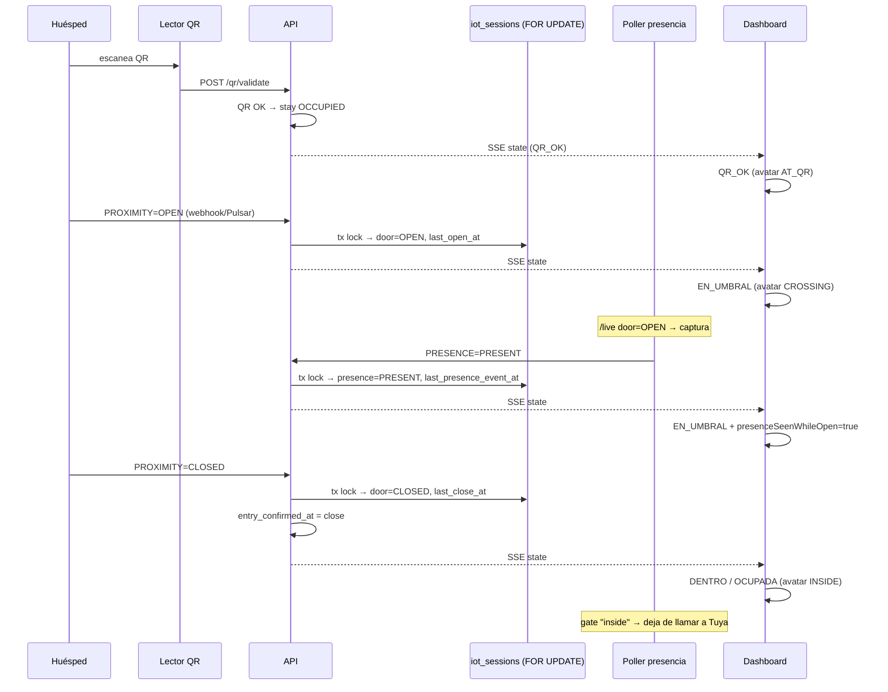
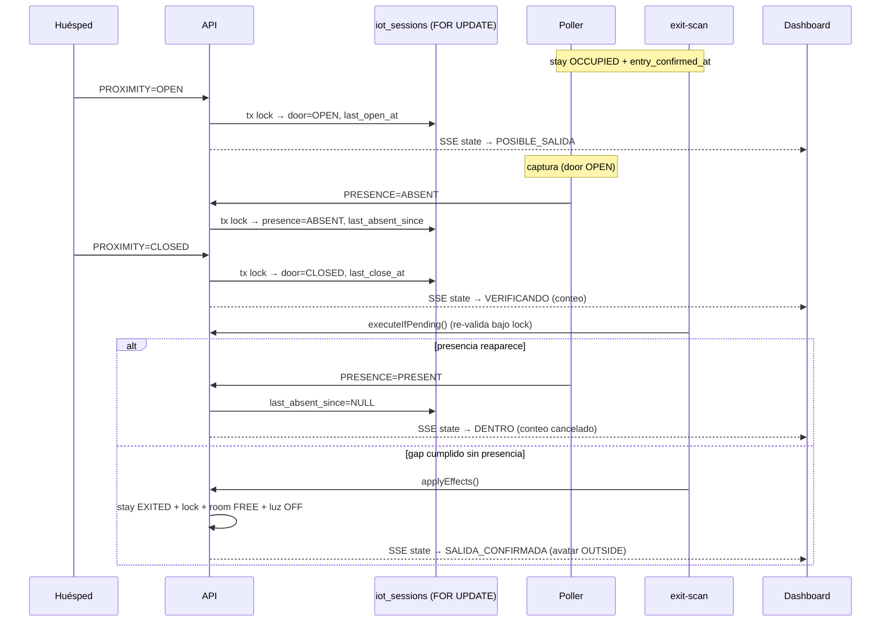

# Design — Cerraduras Hotel

---

# Fase 1: Robustez firmware ESP32 QR Reader

## Arquitectura general

El firmware actual (`scanner-relay-prod.ino`) es un sketch Arduino monociclo (`setup()` + `loop()`). La Fase 1 NO introduce FreeRTOS ni tareas separadas. Simplemente reemplaza patrones bloqueantes por patrones no bloqueantes y añade protecciones.

## 1. Watchdog Timer

**Ubicación**: `setup()`, **línea ~274** (después de `Serial.begin` y antes del resto de setup).

```cpp
#include "esp_task_wdt.h"

void setup() {
  Serial.begin(115200);
  // Arduino-ESP32 core 3.x (IDF 5.x): esp_task_wdt_init() toma un config-struct.
  // Core 2.x legado (IDF 4.x) usaba esp_task_wdt_init(60, true).
#if ESP_ARDUINO_VERSION_MAJOR >= 3
  esp_task_wdt_config_t wdt_cfg = {
      .timeout_ms     = 60000,   // 60s
      .idle_core_mask = 0,       // no vigilar idle tasks
      .trigger_panic  = true,    // panic/reboot al expirar
  };
  esp_task_wdt_init(&wdt_cfg);
#else
  esp_task_wdt_init(60, true);   // core 2.x legado
#endif
  esp_task_wdt_add(NULL);       // vigila la tarea actual (loop)
  ...
}
```

**En `loop()`**, al inicio:
```cpp
void loop() {
  esp_task_wdt_reset();  // <-- primera línea
  ...
}
```

Esto garantiza que si cualquier rama del código bloquea el loop por >60s, el ESP32 se reinicia solo.

## 2. Eliminar delays bloqueantes

### 2.1 `delay(1)` → `yield()`

**Línea 639**:
```cpp
// Antes:
delay(1);

// Ahora:
yield();  // cede control al RTOS, suficiente para WiFi y USB
```

### 2.2 Relé no bloqueante (RF-2.3)

**Estado actual** (L137-146):
```cpp
void relayPulse() {
  relayOn();
  delay(OPEN_DURATION_MS);   // 3 segundos BLOQUEANTES
  relayOff();
}
```

**Nuevo diseño** — máquina de estados con timer:

Variables globales nuevas:
```cpp
unsigned long relayOffAt = 0;       // millis() cuando toca apagar el relé
bool          relayPulsing = false; // ¿estamos en pulso de apertura?
```

La función `relayPulse()` cambia a:
```cpp
void relayPulse() {
  relayOn();
  relayOffAt = millis() + OPEN_DURATION_MS;
  relayPulsing = true;
}
```

Y en `loop()`, después del bloque de heartbeat, se añade:
```cpp
// ── Relé no bloqueante ──
if (relayPulsing && millis() > relayOffAt) {
  relayOff();
  relayPulsing = false;
}
```

### 2.3 LED no bloqueante (RF-2.4)

**Estado actual** (L96-105):
```cpp
void wifiConnectedFeedback() {
  digitalWrite(LED_PIN, HIGH);
  relayClick();
  delay(LED_ON_MS);  // 4.5 segundos BLOQUEANTES
  digitalWrite(LED_PIN, LOW);
}
```

**Nuevo diseño**:

Variable global nueva:
```cpp
unsigned long ledOffAt = 0;
```

`wifiConnectedFeedback()` cambia a:
```cpp
void wifiConnectedFeedback() {
  digitalWrite(LED_PIN, HIGH);
  relayClick();  // 150ms de clic — esto SÍ es aceptable como delay corto
  ledOffAt = millis() + LED_ON_MS - RELAY_CLICK_MS; // compensar el delay del clic
}
```

Y en `loop()`:
```cpp
// ── LED no bloqueante ──
if (ledOffAt && millis() > ledOffAt) {
  digitalWrite(LED_PIN, LOW);
  ledOffAt = 0;
}
```

### 2.4 QR pendiente sin WiFi no bloqueante (RF-2.2)

**Estado actual** (L462-464):
```cpp
if (!ensureWiFi()) {
  Serial.println("[QR] Pendiente pero sin WiFi — esperando reconexion...");
  delay(1000); return;
}
```

**Nuevo diseño**: simplemente reencolar el QR y reintentar en la siguiente iteración del loop:

```cpp
if (!ensureWiFi()) {
  static unsigned long lastWifiWarn = 0;
  if (millis() - lastWifiWarn > 5000) {
    Serial.println("[QR] Pendiente pero sin WiFi — esperando reconexion...");
    lastWifiWarn = millis();
  }
  hasPending = true;  // reencolar para siguiente iteración
  return;
}
```

Esto evita spamear el Serial cada 1ms y permite que el loop siga procesando heartbeat, identify, etc.

## 3. Prevenir fragmentación de heap (RF-3)

**Principio**: llamar a `.reserve(N)` ANTES de concatenar con `+`. Esto pre-asigna un buffer contiguo y evita realocaciones.

### 3.1 POST QR validate (L479-483)

```cpp
String body;
body.reserve(600);  // qr_text puede tener ~400 chars + device_id ~15 + JSON ~60
body = "{\"qr_text\":\"" + qrEscaped + "\",\"device_id\":\"" + id + "\"}";
```

### 3.2 sendIdentify (L250-251)

```cpp
String body;
body.reserve(200);
body = "{\"external_id\":\"" + id + "\",\"state\":" + (state ? "true" : "false") + "}";
```

### 3.3 Heartbeat batch (L534)

```cpp
String hbBody;
hbBody.reserve(250);
hbBody = "{\"external_id\":\"" + chipId() + "\",\"sub_kinds\":[\"RPI\",\"SCANNER\",\"LOCK\"]}";
```

### 3.4 Command result (L588-594)

```cpp
String resultBody;
resultBody.reserve(350);
resultBody = "{\"command_id\":" + String(cmdId) +
             ",\"external_id\":\"" + chipId() + "\"" +
             ",\"results\":{" +
             "\"RPI\":true," +
             "\"SCANNER\":" + String(scannerOk ? "true" : "false") + "," +
             "\"LOCK\":" + String(lockOk ? "true" : "false") +
             "}}";
```

## 4. Auto-reinicio si WiFi caído > 2 min (RF-4)

Variables globales nuevas:
```cpp
unsigned long wifiDownSince = 0;  // 0 = WiFi OK, >0 = millis() del momento de caída
```

En `loop()`, después del bloque de heartbeat (que ya llama a `ensureWiFi()`), añadir:

```cpp
// ── WiFi watchdog ──
if (WiFi.status() != WL_CONNECTED) {
  if (wifiDownSince == 0) {
    wifiDownSince = millis();
    Serial.println("[WIFI] Conexión perdida — iniciando contador de 120s para reinicio");
  } else if (millis() - wifiDownSince > 120000) {
    Serial.println("[WIFI] 120s sin conexión — reiniciando ESP32...");
    delay(500);
    ESP.restart();
  }
} else {
  wifiDownSince = 0;  // WiFi OK → resetear contador
}
```

## 5. Diagnóstico de heap (RF-6)

En el bloque de heartbeat (línea ~521), añadir después de `lastBeat = now`:

```cpp
unsigned long heap = ESP.getFreeHeap();
Serial.printf("[HB] Free heap: %lu bytes\n", heap);
if (heap < 20480) {
  Serial.printf("[HB] ⚠️ ADVERTENCIA: heap bajo (%lu bytes) — posible fuga de memoria\n", heap);
}
```

## 6. Resumen de variables globales nuevas

| Variable | Tipo | Inicial | Propósito |
|----------|------|---------|-----------|
| `relayOffAt` | `unsigned long` | `0` | Timestamp para apagar relé |
| `relayPulsing` | `bool` | `false` | ¿Relé en pulso activo? |
| `ledOffAt` | `unsigned long` | `0` | Timestamp para apagar LED |
| `wifiDownSince` | `unsigned long` | `0` | Timestamp de caída WiFi |

## 7. Cambios en `setup()` — resumen

```cpp
void setup() {
  Serial.begin(115200);
#if ESP_ARDUINO_VERSION_MAJOR >= 3
  esp_task_wdt_config_t wdt_cfg = {
      .timeout_ms     = 60000,
      .idle_core_mask = 0,
      .trigger_panic  = true,
  };
  esp_task_wdt_init(&wdt_cfg);   // core 3.x (IDF 5.x): config-struct
#else
  esp_task_wdt_init(60, true);   // core 2.x legado (IDF 4.x)
#endif
  esp_task_wdt_add(NULL);
  delay(3000);  // esperar a Serial Monitor en debug — aceptable en setup()

  relayOff();
  // ... resto del setup() sin cambios ...
}
```

## 8. Cambios en `loop()` — estructura final

```cpp
void loop() {
  esp_task_wdt_reset();  // SIEMPRE primera línea

  // ── Procesar QR pendiente ──
  if (hasPending) { ... }

  // ── Heartbeat + F33 + heap log (cada 30s) ──
  unsigned long now = millis();
  if (now - lastBeat > 30000) { ... }

  // ── Relé no bloqueante ──
  if (relayPulsing && millis() > relayOffAt) { relayOff(); relayPulsing = false; }

  // ── LED no bloqueante ──
  if (ledOffAt && millis() > ledOffAt) { digitalWrite(LED_PIN, LOW); ledOffAt = 0; }

  // ── Identify button ──
  // ... sin cambios ...

  // ── WiFi watchdog ──
  if (WiFi.status() != WL_CONNECTED) {
    if (wifiDownSince == 0) wifiDownSince = millis();
    else if (millis() - wifiDownSince > 120000) { delay(500); ESP.restart(); }
  } else { wifiDownSince = 0; }

  yield();  // ceder control al RTOS
}
```

## 9. Lo que NO cambia

- API endpoints, API key, URL base
- Lógica de validación QR (POST, relay, heartbeat)
- GPIOs (relay 16, LED 2, identify 4)
- WiFi provisioning (NVS + WiFiManager)
- USB Host callbacks (onKeyboard, onDeviceConnected)
- Formato de QR (token JWT-like, 2 dots, >=100 chars)
- Heartbeat cada 30s + F33 command polling

---

# Fase 35: Detección de anomalías en el flujo de sensores

## Arquitectura general

El sistema de anomalías se integra como una **capa de observabilidad** sobre el pipeline existente de procesamiento de eventos de sensores. No modifica el comportamiento del negocio (QR, locks, exit rule), solo emite señales cuando detecta patrones inconsistentes.

### Principio de diseño

- **Non-blocking**: la detección de anomalías nunca debe impedir ni retrasar el procesamiento normal de eventos.
- **Idempotente**: una misma condición anómala no debe generar múltiples registros duplicados.
- **Auto-resolutivo**: cuando la condición anómala desaparece, la anomalía se cierra automáticamente (`OPEN → DISMISSED`).
- **Best-effort**: si falla la persistencia de una anomalía, se loguea y se continúa.

## 1. Modelo de datos

### 1.1 Tabla `anomalies`

```sql
CREATE TABLE anomalies (
    id              INT AUTO_INCREMENT PRIMARY KEY,
    room_id         INT NOT NULL,
    stay_id         INT NULL,
    anomaly_type    VARCHAR(50) NOT NULL,        -- 'A1', 'A2', ... 'A8'
    severity        ENUM('LOW','MEDIUM','HIGH','CRITICAL') NOT NULL,
    status          ENUM('OPEN','ACKNOWLEDGED','DISMISSED') NOT NULL DEFAULT 'OPEN',
    context_data    JSON NOT NULL,               -- snapshot del estado IoT al detectar
    detected_at     DATETIME(3) NOT NULL,
    acknowledged_at DATETIME(3) NULL,
    acknowledged_by VARCHAR(100) NULL,
    dismissed_at    DATETIME(3) NULL,
    dismissed_by    VARCHAR(100) NULL,
    created_at      DATETIME(3) NOT NULL DEFAULT CURRENT_TIMESTAMP(3),
    updated_at      DATETIME(3) NOT NULL DEFAULT CURRENT_TIMESTAMP(3) ON UPDATE CURRENT_TIMESTAMP(3),
    
    INDEX idx_room_status (room_id, status),
    INDEX idx_anomaly_type (anomaly_type),
    INDEX idx_severity (severity),
    INDEX idx_detected (detected_at),
    FOREIGN KEY (room_id) REFERENCES rooms(id),
    FOREIGN KEY (stay_id) REFERENCES stays(id)
);
```

### 1.2 `context_data` — estructura JSON

Campo libre que captura el estado relevante en el momento de la detección:

```json
{
    "door_state": "CLOSED",
    "presence_state": "PRESENT",
    "stay_status": "OCCUPIED",
    "room_status": "OCCUPIED",
    "last_open_at": "2026-07-25T10:30:00.000Z",
    "last_close_at": "2026-07-25T10:30:05.000Z",
    "last_absent_since": null,
    "trigger_event": {
        "sensor": "PRESENCE",
        "value": "PRESENT",
        "source_event_id": "tuya-ev-12345"
    },
    "relevant_window": {
        "door_events_last_24h": 3,
        "last_door_open_seconds_ago": 86400,
        "presence_duration_seconds": 25200
    }
}
```

## 2. Detectores de anomalías

Cada tipo de anomalía tiene su propio detector. Se organizan en un registry para evaluación encadenada.

### 2.1 `AnomalyDetector` (interfaz)

```php
interface AnomalyDetector {
    public function detect(IotSession $session, PresenceEvent $trigger, ?Stay $stay): ?AnomalyResult;
}

class AnomalyResult {
    public string $type;       // 'A1', 'A2', ...
    public string $severity;
    public array  $contextData;
}
```

### 2.2 `AnomalyPipeline`

```php
class AnomalyPipeline {
    /** @var AnomalyDetector[] */
    private array $detectors;
    
    public function evaluate(IotSession $session, PresenceEvent $trigger, ?Stay $stay): array {
        $results = [];
        foreach ($this->detectors as $detector) {
            try {
                $result = $detector->detect($session, $trigger, $stay);
                if ($result !== null) {
                    $results[] = $result;
                }
            } catch (\Throwable $e) {
                // Non-blocking: log and continue
                error_log("[ANOMALY] Detector {$detector::class} failed: {$e->getMessage()}");
            }
        }
        return $results;
    }
}
```

### 2.3 Punto de inserción en el pipeline existente

En `IotSessionService::processEvent()`, después de actualizar `door_state`/`presence_state` y **antes** de evaluar la regla de salida:

```
processEvent($event):
    1. Validar room
    2. Persistir presence_event (idempotente)
    3. Cargar/crear iot_session
    4. Actualizar door_state / presence_state / timestamps
    5. Persistir iot_session
    ─── NUEVO ───
    6. AnomalyPipeline::evaluate(iot_session, trigger_event, active_stay)
        → persistir anomalías detectadas
    ─── EXISTENTE ───
    7. ExitRuleEvaluator::evaluate()
    8. Si exit → ExitActionService::execute()
```

## 3. Lógica de detección por tipo

### A1 — Presencia sin apertura de puerta

**Disparador**: evento `PRESENCE=PRESENT`.

**Condición**: `door_state` nunca fue `OPEN` desde `first_entry_at` del stay activo (o desde que la room quedó FREE si no hay stay).

**Implementación**:
```php
class PresenceWithoutDoorOpen implements AnomalyDetector {
    public function detect(IotSession $session, PresenceEvent $trigger, ?Stay $stay): ?AnomalyResult {
        if ($trigger->sensor !== 'PRESENCE' || $trigger->value !== 'PRESENT') return null;
        if (!$stay || $stay->status !== 'OCCUPIED') return null;
        
        // Buscar evento PROXIMITY=OPEN desde first_entry_at
        $hasOpen = PresenceEventRepository::hasProximityOpenSince(
            $session->roomId, 
            $stay->firstEntryAt
        );
        
        if ($hasOpen) return null;
        
        return new AnomalyResult(
            type: 'A1',
            severity: 'HIGH',
            contextData: [
                'door_state' => $session->doorState,
                'presence_state' => $session->presenceState,
                'stay_status' => $stay->status,
                'first_entry_at' => $stay->firstEntryAt,
                'last_open_at' => $session->lastOpenAt,
            ]
        );
    }
}
```

### A2 — Presencia en habitación sin stay

**Disparador**: evento `PRESENCE=PRESENT`.

**Condición**: room no tiene stay en `OCCUPIED` ni `EXITED`.

### A3 — Puerta abierta sin QR ni stay

**Disparador**: evento `PROXIMITY=OPEN`.

**Condición**: no hay stay `OCCUPIED` Y no hay `access_event` de tipo `QR_VALIDATE` en los últimos 30s para esa room.

### A4 — Presencia sin actividad de puerta

**Disparador**: evaluación periódica (`bin/anomaly-scanner.php`).

**Condición**: `presence_state = PRESENT` de forma ininterrumpida durante más de `duracion_minutos + 7200s` (2h de margen), sin ningún evento `PROXIMITY` en ese intervalo.

### A5 — EXITED sin apertura de salida

**Disparador**: evento de transición `stay.status → EXITED`.

**Condición**: `last_open_at` es null o es anterior a `first_entry_at` o tiene más de 2h de antigüedad respecto a `exit_detected_at`.

**Punto de inserción**: en `ExitActionService::execute()`, después de ejecutar los side-effects.

### A6 — Presencia post-EXITED

**Disparador**: evento `PRESENCE=PRESENT`.

**Condición**: el stay más reciente de la room está en `EXITED` y `exit_detected_at < now`.

### A7 — Puerta abierta sin presencia

**Disparador**: evaluación periódica.

**Condición**: `door_state = OPEN` Y `presence_state = ABSENT` Y `(now - last_open_at) > 120s`.

### A8 — Flapping de sensor

**Disparador**: cada evento de sensor.

**Condición**: contar transiciones del mismo sensor en los últimos `flapping_window_seconds` (30s). Si ≥ `flapping_threshold` (5) → anomalía.

## 4. Evaluación periódica (`anomaly-scanner.php`)

Nuevo worker similar a `exit-scan.php` y `overstay-scan.php`. Se ejecuta cada 15 segundos y evalúa anomalías que dependen de ventanas temporales (A4, A7, y auto-dismiss de anomalías resueltas).

```
anomaly-scanner.php (cada 15s):
    1. Para cada room con iot_session activo:
        a. Evaluar A4 (presencia sin actividad puerta)
        b. Evaluar A7 (puerta abierta sin presencia)
    2. Para cada anomalía OPEN:
        a. Si la condición ya no se cumple → DISMISSED
```

## 5. Servicio `AnomalyService`

```php
class AnomalyService {
    public function detectAndPersist(IotSession $session, PresenceEvent $trigger, ?Stay $stay): array;
    public function acknowledge(int $anomalyId, string $actor): void;
    public function autoDismiss(int $roomId, string $anomalyType): void;
    public function findByRoom(int $roomId, ?string $status): array;
    public function findAll(?string $severity, ?string $status, ?int $roomId): array;
}
```

### Deduplicación

Antes de insertar una nueva anomalía, verificar si ya existe una con `OPEN` para la misma `(room_id, anomaly_type)`:

```sql
SELECT id FROM anomalies 
WHERE room_id = ? AND anomaly_type = ? AND status = 'OPEN' 
LIMIT 1;
```

Si existe → no insertar (la anomalía ya está reportada).

## 6. Integración con RoomLiveController

El endpoint `GET /api/v1/rooms/{id}/live` ya devuelve datos agregados de la room. Se añade un campo `anomalies`:

```json
{
    "room": { ... },
    "stay": { ... },
    "iot": { ... },
    "anomalies": [
        {
            "id": 42,
            "anomaly_type": "A1",
            "severity": "HIGH",
            "status": "OPEN",
            "detected_at": "2026-07-25T10:30:00.000Z",
            "context_data": { ... }
        }
    ]
}
```

Solo se incluyen anomalías con `status = 'OPEN'`.

## 7. Dashboard

### Indicador por room

Cada tarjeta de room en el panel muestra un badge con el conteo de anomalías activas. Color según la severidad más alta:
- `CRITICAL`: badge rojo con icono ⚠
- `HIGH`: badge naranja
- `MEDIUM`: badge amarillo
- `LOW`: badge gris

### Vista de anomalías

Se añade una sección en el panel (`/panel/anomalies` opcional o integrada en el dashboard principal) con:
- Filtros: room, tipo, severidad, estado
- Tabla/listado con: room, tipo, severidad, detectada hace, estado
- Acción "Reconocer" (ACKNOWLEDGE) por fila

## 8. Archivos nuevos y modificados

| Archivo | Acción |
|---------|--------|
| `api/src/Domain/Anomalies/Anomaly.php` | Nuevo — modelo |
| `api/src/Domain/Anomalies/AnomalyDetector.php` | Nuevo — interfaz |
| `api/src/Domain/Anomalies/AnomalyPipeline.php` | Nuevo — orquestador |
| `api/src/Domain/Anomalies/AnomalyService.php` | Nuevo — servicio |
| `api/src/Domain/Anomalies/Detectors/A1_PresenceWithoutDoorOpen.php` | Nuevo |
| `api/src/Domain/Anomalies/Detectors/A2_PresenceWithoutStay.php` | Nuevo |
| `api/src/Domain/Anomalies/Detectors/A3_DoorOpenWithoutQr.php` | Nuevo |
| `api/src/Domain/Anomalies/Detectors/A4_PresenceWithoutDoorActivity.php` | Nuevo |
| `api/src/Domain/Anomalies/Detectors/A5_ExitedWithoutDoorOpen.php` | Nuevo |
| `api/src/Domain/Anomalies/Detectors/A6_PresenceAfterExit.php` | Nuevo |
| `api/src/Domain/Anomalies/Detectors/A7_DoorOpenWithoutPresence.php` | Nuevo |
| `api/src/Domain/Anomalies/Detectors/A8_SensorFlapping.php` | Nuevo |
| `api/src/Domain/Anomalies/AnomalyRepositoryInterface.php` | Nuevo — interfaz BD |
| `api/src/Infrastructure/Persistence/AnomalyRepository.php` | Nuevo — implementación |
| `api/src/Http/Controllers/AnomalyController.php` | Nuevo |
| `api/public/index.php` | Modificado — rutas de anomalías |
| `api/bin/anomaly-scanner.php` | Nuevo — worker periódico |
| `api/src/Domain/Presence/IotSessionService.php` | Modificado — insertar pipeline |
| `api/src/Domain/Presence/ExitActionService.php` | Modificado — detectar A5 |
| `api/src/Http/Controllers/RoomLiveController.php` | Modificado — incluir anomalías |
| `api/public/panel/` | Modificado — dashboard |
| `api/bin/migrate.php` | Añadir migración `anomalies` |

## 9. Lo que NO cambia

- La máquina de estados de Stay (ninguna transición nueva)
- Las reglas de salida (exit rule)
- El procesamiento de QR (emisión/validación)
- Los comandos de lock
- El worker de overstay
- El outbox / WS-VB6
- La simulación (`/sim/*`)

---

# Fase 37: Vista de anomalías con filtro de estado

## Arquitectura general

F37 extiende F35 sin modificar su núcleo. Los cambios son:

1. **Backend**: nuevo método `findResolvableForRoom()` en el repositorio para incluir ACKNOWLEDGED en la auto-resolución. El controller acepta `status=ALL` para omitir el filtro de estado.
2. **Frontend**: nuevo dropdown de estado en la barra de filtros, renderizado condicional por estado, badges visuales.

## 1. Auto-resolución de ACKNOWLEDGED

### Problema

`autoResolveForRoom()` en `AnomalyService` usaba `findOpenForRoom()` que solo devuelve `status='OPEN'`. Las anomalías ACKNOWLEDGED nunca se evaluaban y quedaban en ese estado para siempre.

### Solución

Nuevo método `findResolvableForRoom(int $roomId): array` en el repositorio:

```sql
SELECT ... FROM anomalies
WHERE room_id = :rid AND status IN ('OPEN', 'ACKNOWLEDGED')
ORDER BY detected_at DESC
```

`autoResolveForRoom()` ahora usa `findResolvableForRoom()` en lugar de `findOpenForRoom()`. El método `autoDismiss()` en `Anomaly` ya acepta ambos estados (su guarda es solo contra DISMISSED), así que no requiere cambios.

## 2. Controller — soporte para status=ALL

```php
// AnomalyController::index()
if (isset($params['status']) && $params['status'] !== '' && $params['status'] !== 'ALL') {
    $filters['status'] = (string) $params['status'];
} elseif (!isset($params['status'])) {
    $filters['status'] = 'OPEN'; // backward compat
}
// else: status is empty or 'ALL' → no status filter added → shows all
```

## 3. Frontend — filtro de estado

### 3.1 Dropdown

Se añade un cuarto `<select>` al `filterRow`:

```html
<select onchange="...">
  <option value="OPEN">📌 Pendientes</option>
  <option value="ACKNOWLEDGED">👁️ Reconocidas</option>
  <option value="DISMISSED">✅ Histórico</option>
  <option value="ALL">📋 Todas</option>
</select>
```

Los `onchange` de los otros dropdowns se actualizan para preservar el valor de `status` al cambiar otros filtros.

### 3.2 `loadAnomalies()`

```javascript
let st = this.anomalyFilters?.status || 'OPEN';
let params = new URLSearchParams({limit:'100'});
if (st && st !== 'ALL') params.set('status', st);
```

### 3.3 Renderizado condicional

- **Columna Estado**: badge con clase CSS `status-open` (rojo), `status-acked` (naranja), `status-dismissed` (verde).
- **Columna Acción**: si `OPEN` → botón "✓ Reconocer"; si `ACKNOWLEDGED`/`DISMISSED` → texto "por X · fecha".
- **Encabezado**: refleja el filtro activo ("Pendientes", "Reconocidas", "Histórico", "Todas").
- **Vacío contextual**: "Sin anomalías pendientes" vs "Sin anomalías reconocidas" vs "Sin anomalías".

## 4. Archivos modificados

| Archivo | Cambio |
|---------|--------|
| `api/src/Domain/Anomalies/AnomalyRepositoryInterface.php` | Nuevo método `findResolvableForRoom()` |
| `api/src/Domain/Anomalies/AnomalyRepository.php` | Implementación `findResolvableForRoom()` |
| `api/src/Domain/Anomalies/AnomalyService.php` | `autoResolveForRoom()` usa `findResolvableForRoom()` |
| `api/src/Http/Controllers/AnomalyController.php` | Soporte `status=ALL` / vacío |
| `api/public/panel/index.html` | Dropdown estado, badges, renderizado condicional, CSS |

## 5. Lo que NO cambia

- La máquina de estados de Anomaly (OPEN → ACKNOWLEDGED → DISMISSED)
- Los detectores A1–A8
- El pipeline de detección
- `checkAnomalyAlerts()` y `loadAnomalySummary()` — siguen contando solo OPEN
- Ningún endpoint nuevo

---

# Fase 36: Monitoreo de batería del sensor de puerta MC400D

## 1. Estrategia de obtención de datos

### 1.1 Push (pasivo) — vía webhook Tuya

El `TuyaSensorIngress` ya recibe los DPs del MC400D en cada push. Actualmente `battery_percentage` está en la lista `INFO_DPS` y se descarta. La F36 modifica el comportamiento: cuando se detecta `battery_percentage`, en lugar de solo saltarlo, se persiste en `devices.battery_pct`.

**Lugar de la modificación**: `TuyaSensorIngress::normalize()`, después de identificar el device via `$this->deviceRepo->findByExternalId($devId)` y antes del mapeo DP→evento canónico. Se itera sobre todos los DPs del push y, si alguno coincide con `INFO_DPS`, se persiste su valor.

**Ventaja**: Cero llamadas adicionales a Tuya API. La batería se actualiza cada vez que el sensor emite un evento (apertura/cierre de puerta).

### 1.2 Pull (activo) — bajo demanda desde el panel

Nuevo endpoint `POST /dashboard-api/battery-refresh` que:
1. Recibe `{device_id: N}`
2. Busca el dispositivo en BD
3. Llama a Tuya API: `GET /v1.0/iot-03/devices/{external_id}/status`
4. Extrae `battery_percentage` de los DPs en la respuesta
5. Persiste en `devices.battery_pct`
6. Retorna `{ok, device_id, kind, battery_pct, state}`

Usa la misma función `tuyaPresenceApi()` existente en `index.php` para firmar y llamar a la API de Tuya.

## 2. Modelo de datos

### 2.1 Nueva columna en `devices`

```sql
ALTER TABLE devices ADD COLUMN IF NOT EXISTS battery_pct TINYINT UNSIGNED NULL;
```

Se elige columna dedicada (no `meta_json`) porque:
- Es un valor escalar semánticamente significativo
- Consultable directamente en SQL
- Indexable si fuera necesario en el futuro
- Más simple que parsear JSON para cada lectura

### 2.2 Device.php

Nueva propiedad `?int $batteryPct` y campo en `toArray()`.

### 2.3 DeviceRepository

- `hydrate()`: lee `battery_pct` de la fila SQL
- `updateBattery(int $deviceId, ?int $pct)`: `UPDATE devices SET battery_pct = ? WHERE id = ?`

## 3. Umbrales de batería

| Estado | Condición | Icono |
|--------|-----------|-------|
| `critical` | `pct <= 10` | 🔴 |
| `low` | `10 < pct <= 20` | 🟡 |
| `normal` | `pct > 20` | 🟢 |
| `unknown` | `pct IS NULL` | ⚪ |

Estos umbrales son consistentes con el comportamiento típico de dispositivos Tuya con pilas AAA/LR03.

## 4. Endpoints modificados / nuevos

### 4.1 Nuevo: `POST /dashboard-api/battery-refresh`

- **Auth**: Sin auth (LAN/MVP, igual que el resto de dashboard-api)
- **Body**: `{"device_id": N}`
- **Llamada Tuya**: `GET /v1.0/iot-03/devices/{external_id}/status`
- **Persistencia**: `UPDATE devices SET battery_pct = ? WHERE id = ?`
- **Respuesta 200**:
  ```json
  {"ok":true,"device_id":5,"kind":"PROXIMITY","battery_pct":87,"state":"normal"}
  ```
- **Errores**: 400 (device_id faltante), 404 (dispositivo no encontrado), 502 (error Tuya API)

### 4.2 Modificado: `GET /dashboard-api/device-status?room_id=N`

Añadir `battery_pct` al SELECT y al array de respuesta de cada dispositivo.

### 4.3 Modificado: `GET /dashboard-api/pack-detail?pack_id=N`

Igual que device-status: añadir `battery_pct` a la respuesta.

### 4.4 Modificado: `GET /api/v1/rooms/{id}/live`

Nuevo campo `battery` en la respuesta:
```json
"battery": {"device_id":3,"kind":"PROXIMITY","label":"Sensor Puerta","pct":87,"state":"normal"}
```
Solo se incluye si la habitación tiene un dispositivo PROXIMITY en su pack.

## 5. Panel (UI)

### 5.1 CRM Panel (`panel/index.html`)

En `openRoomDetail()`, para cada dispositivo PROXIMITY:
- Mostrar `🔋 87%` con color según umbral
- Botón `🔄` que llama a `POST /dashboard-api/battery-refresh`

### 5.2 Dashboard (`dashboard.html`)

En el panel de dispositivos, junto a "Sensor Puerta":
- Mostrar indicador de batería con porcentaje y color
- Botón de refresh

## 6. Archivos afectados

| Archivo | Cambio |
|---------|--------|
| `api/migrations/0043_battery_pct.sql` | Nuevo — columna `battery_pct` |
| `api/src/Domain/Devices/Device.php` | Propiedad `batteryPct` |
| `api/src/Domain/Devices/DeviceRepository.php` | `hydrate()` + `updateBattery()` |
| `api/src/Infrastructure/Gateways/Sensor/TuyaSensorIngress.php` | Persistir battery en push |
| `api/public/index.php` | Nuevo endpoint `battery-refresh` + modificar device-status/pack-detail |
| `api/src/Http/Controllers/RoomLiveController.php` | Campo `battery` en live |
| `api/public/panel/index.html` | Indicador + botón en room detail |
| `api/public/dashboard.html` | Indicador de batería |
| `api/tests/Unit/ChipBatteryTest.php` | Nuevo — unit test |
| `api/bin/run-tests.sh` | BLOCK 26 — HTTP tests |

## 7. Lo que NO cambia

- La máquina de estados de Stay/Room/IoT Session
- Los comandos de lock/switch
- El pipeline de presencia
- La detección de anomalías existente
- El worker de overstay
- La simulación (`/sim/*`)


---
# Fase 38: Workers — Trabajadores del hotel con QR maestro

## 1. Modelo de datos

### Tablas nuevas

```sql
CREATE TABLE worker_roles (
    id          INT AUTO_INCREMENT PRIMARY KEY,
    name        VARCHAR(50) NOT NULL,
    description VARCHAR(255) NULL,
    created_at  DATETIME(3) NOT NULL DEFAULT (UTC_TIMESTAMP(3)),
    updated_at  DATETIME(3) NOT NULL DEFAULT (UTC_TIMESTAMP(3))
) ENGINE=InnoDB DEFAULT CHARSET=utf8mb4;

CREATE TABLE worker_role_room_types (
    id           INT AUTO_INCREMENT PRIMARY KEY,
    role_id      INT NOT NULL,
    room_type_id INT NOT NULL,
    created_at   DATETIME(3) NOT NULL DEFAULT (UTC_TIMESTAMP(3)),
    UNIQUE KEY uq_role_roomtype (role_id, room_type_id),
    FOREIGN KEY (role_id)      REFERENCES worker_roles(id),
    FOREIGN KEY (room_type_id) REFERENCES room_types(id)
) ENGINE=InnoDB DEFAULT CHARSET=utf8mb4;

CREATE TABLE workers (
    id            INT AUTO_INCREMENT PRIMARY KEY,
    name          VARCHAR(100) NOT NULL,
    role_id       INT NOT NULL,
    qr_token_hash VARCHAR(64) NOT NULL,
    qr_jti        VARCHAR(36) NOT NULL UNIQUE,
    active        BOOLEAN NOT NULL DEFAULT TRUE,
    notes         TEXT NULL,
    created_at    DATETIME(3) NOT NULL DEFAULT (UTC_TIMESTAMP(3)),
    updated_at    DATETIME(3) NOT NULL DEFAULT (UTC_TIMESTAMP(3)),
    FOREIGN KEY (role_id) REFERENCES worker_roles(id)
) ENGINE=InnoDB DEFAULT CHARSET=utf8mb4;

CREATE TABLE worker_sessions (
    id             INT AUTO_INCREMENT PRIMARY KEY,
    worker_id      INT NOT NULL,
    room_id        INT NOT NULL,
    entered_at     DATETIME(3) NOT NULL,
    exited_at      DATETIME(3) NULL,
    exit_kind      VARCHAR(16) NULL COMMENT 'QR_SCAN|EXIT_RULE|DOOR_EVENT|AUTO',
    correlation_id VARCHAR(64) NULL,
    created_at     DATETIME(3) NOT NULL DEFAULT (UTC_TIMESTAMP(3)),
    updated_at     DATETIME(3) NOT NULL DEFAULT (UTC_TIMESTAMP(3)),
    FOREIGN KEY (worker_id) REFERENCES workers(id),
    FOREIGN KEY (room_id)   REFERENCES rooms(id)
) ENGINE=InnoDB DEFAULT CHARSET=utf8mb4;
```

### Campo añadido a tabla existente

```sql
ALTER TABLE access_events ADD COLUMN worker_session_id INT NULL AFTER stay_id;
ALTER TABLE access_events ADD FOREIGN KEY (worker_session_id) REFERENCES worker_sessions(id);
```

- **worker_session_id**: opcional, para trazar eventos de acceso a sesiones de worker. Los eventos de guest usan `stay_id` (ya existente), los de worker usan `worker_session_id`.

### Ocupación en tiempo real (sin tabla extra)

Consulta UNION sobre `stays` activos + `worker_sessions` abiertas:

```sql
SELECT 'guest' AS occupant_type, s.id AS occupant_id FROM stays s
  WHERE s.room_id = ? AND s.status IN ('OCCUPIED','OVERSTAY')
UNION ALL
SELECT 'worker' AS occupant_type, ws.id AS occupant_id FROM worker_sessions ws
  WHERE ws.room_id = ? AND ws.exited_at IS NULL
```

## 2. Formato del token QR de trabajador

### Payload JWT

```json
{
  "sub": "worker",
  "wid": 5,
  "jti": "550e8400-e29b-41d4-a716-446655440000",
  "iat": 1690900000,
  "exp": 1893456000
}
```

### QrTokenizer (extensión)

El `QrTokenizer` existente debe soportar un discriminador `sub`:
- `sub: "guest"` → comportamiento actual (validación contra `qr_credentials`)
- `sub: "worker"` → validación contra `workers.qr_jti` + `workers.qr_token_hash`

La firma HMAC usa el mismo `QR_SIGNING_SECRET` que los guest QR.

### Generación del token (POST /workers o POST /workers/{id}/qr)

```php
$jti = uuid_v4();
$payload = [
    'sub' => 'worker',
    'wid' => $worker->id,
    'jti' => $jti,
    'iat' => time(),
    'exp' => time() + (10 * 365 * 86400), // ~10 años
];
$token = QrTokenizer::sign($payload);
// Guardar hash en workers.qr_token_hash y workers.qr_jti
```

### Validación (POST /workers/qr/validate)

```php
$claims = QrTokenizer::verify($token);  // verifica firma + expiración
if ($claims['sub'] !== 'worker') { /* rechazar */ }
$worker = $this->workerRepo->findByJti($claims['jti']);
if (!$worker || !$worker->active) { /* qr_revoked */ }
// Verificar acceso del rol al room_type
if (!$this->workerService->canAccessRoomType($worker->role, $roomTypeId)) {
    /* access_denied */
}
// Sin restricciones de stay ni cooldown → abrir puerta
```

## 3. Flujo de validación QR (guest vs worker)

El router de `POST /qr/validate` discrimina por `sub`:

```
POST /api/v1/qr/validate (guest)
POST /api/v1/workers/qr/validate (worker)
```

Ambos endpoints comparten infraestructura (QrTokenizer, LockGateway, AccessEvent) pero divergen en:
- Guest: validación contra `qr_credentials` + stay state machine + time slots + cooldown
- Worker: validación contra `workers` + `worker_role_room_types` + sin restricciones

## 4. Modificación de la regla de salida

### Escenario A — Salida total (exit rule dispara)

Condiciones: door CLOSED + absence sostenida >= `exit_presence_gap_seconds`.

**Nuevo flujo** (en `IotSessionService::processEvent()`, bloque de exit rule):

```
1. Cargar worker_sessions activas (exited_at IS NULL) para este room
2. Para cada worker_session activa:
   a) worker_session.exited_at = now
   b) worker_session.exit_kind = 'EXIT_RULE'
   c) access_event: KIND=WORKER_EXIT, worker_session_id=ws.id
3. Si hay stay activo OCCUPIED → ejecutar ExitActionService (comportamiento actual)
4. Si NO hay stay activo pero sí workers → solo ejecutar side-effects de lock/luz
```

### Escenario B — Solo el worker sale (door close + presence still present)

**Ubicación**: `IotSessionService::processEvent()`, dentro del case `PROXIMITY CLOSED`, justo después de persistir door_state.

```php
// Dentro de processEvent(), case PROXIMITY CLOSED:
if ($value === PresenceEvent::VALUE_CLOSED) {
    // ... actualizar door_state (existente) ...

    // NUEVO: Worker exit por door event
    if ($session->presenceState === IotSession::PRESENCE_PRESENT) {
        $activeWorkerSessions = $this->workerSessionRepo->findActiveForRoom($roomId);
        if (!empty($activeWorkerSessions)) {
            // Si presencia sigue detectada, guest se queda → worker salió
            // Cerrar solo la sesión más reciente (el que acaba de salir)
            $latest = $activeWorkerSessions[count($activeWorkerSessions)-1];
            $this->workerSessionRepo->close($latest->id, 'DOOR_EVENT');
            // access_event WORKER_EXIT
            $this->accessEvents->insert(
                $roomId, null, AccessEvent::KIND_WORKER_EXIT,
                AccessEvent::RESULT_OK, null, $provider,
                $correlationId, ['worker_session_id' => $latest->id]
            );
        }
    }
}
```

## 5. Endpoints API (rutas nuevas en index.php)

| Método | Ruta | Controlador |
|--------|------|-------------|
| GET | `/api/v1/workers` | `WorkerController::list` |
| POST | `/api/v1/workers` | `WorkerController::create` |
| GET | `/api/v1/workers/{id}` | `WorkerController::show` |
| PATCH | `/api/v1/workers/{id}` | `WorkerController::update` |
| DELETE | `/api/v1/workers/{id}` | `WorkerController::deactivate` |
| POST | `/api/v1/workers/{id}/qr` | `WorkerController::regenerateQr` |
| GET | `/api/v1/workers/{id}/sessions` | `WorkerController::sessions` |
| POST | `/api/v1/workers/qr/validate` | `WorkerQrController::validate` |
| GET | `/api/v1/worker-roles` | `WorkerRoleController::list` |
| POST | `/api/v1/worker-roles` | `WorkerRoleController::create` |
| GET | `/api/v1/worker-roles/{id}` | `WorkerRoleController::show` |
| PATCH | `/api/v1/worker-roles/{id}` | `WorkerRoleController::update` |
| DELETE | `/api/v1/worker-roles/{id}` | `WorkerRoleController::delete` |
| GET | `/api/v1/rooms/{id}/occupants` | `RoomLiveController::occupants` |
| GET | `/api/v1/workers/inside` | `WorkerController::inside` |

## 6. Panel CRM (panel/index.html)

### Vistas nuevas

1. **Workers (listado)**: Tabla con nombre, rol, activo/inactivo, último acceso, ubicación actual, acciones.
2. **Worker (crear/editar)**: Formulario con nombre, rol (dropdown), notas. Al crear, mostrar QR token en modal (una sola vez). Botón "Regenerar QR" con confirmación.
3. **Worker (detalle/panel)**: Historial de sesiones (habitación, entrada/salida, duración), habitaciones visitadas hoy, ubicación actual, último acceso, tiempo medio por tipo de habitación.
4. **Worker Roles**: Listado + formulario CRUD con checkboxes de room_types asignados.
5. **Room detail (extensión)**: Nueva pestaña/sección "Servicio" con trabajadores que han entrado hoy, tiempo acumulado, último servicio.
6. **Dashboard (extensión)**: Sección "Workers activos" mostrando quién está dentro de qué habitación ahora.

### Alertas

7. **Worker Alertas**: Panel o badge visible con alertas activas:
   - ⏱ Worker X lleva > 120 min en Hab Y
   - 🌙 Worker X entró a Hab Y a las 03:15

## 7. Archivos nuevos y modificados

### Nuevos

| Archivo | Descripción |
|---------|-------------|
| `api/migrations/0044_workers.sql` | Tablas workers, worker_roles, worker_role_room_types, worker_sessions; ALTER access_events |
| `api/src/Domain/Workers/Worker.php` | Entidad Worker |
| `api/src/Domain/Workers/WorkerRepositoryInterface.php` | Interfaz repositorio |
| `api/src/Domain/Workers/WorkerRepository.php` | Implementación PDO |
| `api/src/Domain/Workers/WorkerRole.php` | Entidad rol |
| `api/src/Domain/Workers/WorkerRoleRepositoryInterface.php` | Interfaz |
| `api/src/Domain/Workers/WorkerRoleRepository.php` | Implementación |
| `api/src/Domain/Workers/WorkerSession.php` | Entidad sesión |
| `api/src/Domain/Workers/WorkerSessionRepositoryInterface.php` | Interfaz |
| `api/src/Domain/Workers/WorkerSessionRepository.php` | Implementación |
| `api/src/Domain/Workers/WorkerService.php` | Lógica de negocio (CRUD, QR gen, validación acceso, métricas) |
| `api/src/Domain/Workers/WorkerQrService.php` | Validación QR worker + open door |
| `api/src/Http/Controllers/WorkerController.php` | Endpoints CRUD |
| `api/src/Http/Controllers/WorkerQrController.php` | Endpoint validate |
| `api/src/Http/Controllers/WorkerRoleController.php` | Endpoints CRUD roles |
| `api/tests/Unit/WorkerTest.php` | Tests unitarios |
| `api/tests/Unit/WorkerSessionTest.php` | Tests unitarios sesiones |

### Modificados

| Archivo | Cambio |
|---------|--------|
| `api/public/index.php` | Nuevas rutas (15 endpoints) |
| `api/src/Domain/Locks/AccessEvent.php` | Nueva constante `KIND_WORKER_EXIT` |
| `api/src/Domain/Presence/IotSessionService.php` | Escenario A (exit rule cierra worker sessions) + Escenario B (door close cierra sesión worker) |
| `api/src/Domain/Presence/ExitActionService.php` | Nuevo parámetro opcional WorkerSessionRepository para cerrar sesiones en salida total |
| `api/src/Domain/Qr/QrTokenizer.php` | Soporte para discriminador `sub` (guest vs worker) |
| `api/public/panel/index.html` | Vistas de workers, roles, métricas, alertas |
| `api/bin/run-tests.sh` | Nuevo BLOCK 27 |

## 8. Lo que NO cambia

- El modelo de Stay, Room, IoT Session se mantienen intactos
- Los endpoints existentes de QR guest no se modifican
- El comportamiento del huésped no cambia
- Los workers no tienen impacto en time slots ni facturación

---

# Fase 39: Identificación de fábrica integrada en ESP32 productivo

## 1. Alcance y principio de integración

F39 modifica exclusivamente el sketch productivo
`docs/esp32-qr-reader/scanner-relay-prod.ino`. Se elimina el concepto de
firmware, modo de ejecución o sketch aislado de fábrica. La identificación es
una responsabilidad auxiliar dentro del `loop()` existente y coexiste con QR,
USB Host, relé, GPIO4/identify, watchdog, heartbeat y command queue.

La integración no bifurca el arranque ni condiciona la operación de cerradura:
el flujo WiFi existente (NVS + WiFiManager) permanece intacto y, cuando informa
conectividad, habilita el scheduler de anuncio F39.

## 2. Identidad estable

`chip_id` se calcula en cada arranque desde `ESP.getEfuseMac()` como 12 dígitos
hexadecimales lowercase sin separadores. Es la clave natural de
`factory_devices` y coincide con `devices.external_id` del RPI que crea el
claim. No se almacena como identidad mutable ni se deduce de WiFi.

## 3. Máquina de estados no bloqueante en el sketch

Se añaden estado efímero de RAM y timestamps, por ejemplo:

```text
factoryAnnouncementEnabled = true     // se reinicia a true en cada boot
factoryAnnouncementInFlight = false
factoryNextAttemptAt = 0
```

Flujo:

```text
setup():
  ejecutar setup productivo existente, incluido WiFi/NVS/WiFiManager
  calcular chip_id e inicializar scheduler F39 (sin consultar NVS de claim)

loop():
  ejecutar el loop productivo existente en su orden actual
  si WiFi conectado y factoryAnnouncementEnabled y now >= factoryNextAttemptAt:
      iniciar/realizar un intento acotado de announce
      programar próximo intento, incluso ante error transportable
      si respuesta válida status=PENDING: mantener enabled=true
      si respuesta válida status=CLAIMED: factoryAnnouncementEnabled=false
  yield/watchdog y resto de tareas continúan normalmente
```

El intento debe tener timeout acotado y no usar `delay()` ni bucles de espera.
Si la librería HTTP disponible no permite una operación incremental real, el
diseño de implementación debe usar el mínimo timeout soportado y preservar el
presupuesto de loop; no se aceptan reintentos internos prolongados. Errores de
red o JSON inválido solo cambian `factoryNextAttemptAt` y se registran en Serial.

`CLAIMED` solo apaga `factoryAnnouncementEnabled` en RAM. No se escribe una
bandera `factory_claimed` en NVS: cada boot, reflasheo o NVS wipe vuelve a
consultar al backend mediante `announce`, que es el árbitro del estado.

## 4. Modelo persistente y backend autoritativo

```text
factory_devices
  id, chip_id UNIQUE NOT NULL, status PENDING|CLAIMED,
  first_announced_at, last_announced_at,
  claimed_at NULL, claimed_by NULL, device_id NULL,
  created_at, updated_at
```

`announce(chip_id)` realiza insert-or-update atómico: inserta `PENDING` en la
primera aceptación; después actualiza solo `last_announced_at`. Cuando el
registro ya es `CLAIMED`, conserva status, auditoría y vínculo RPI. Ningún dato
local del ESP32 puede rebajar o reemplazar ese estado.

## 5. Claim manual y panel

El panel lista `PENDING`, muestra `chip_id` y fechas, y expone una acción
manual de claim. En una única transacción el backend: verifica el registro,
cambia `PENDING → CLAIMED`, fija actor/fecha, crea o vincula exactamente un
`devices` de tipo `RPI` con `external_id=chip_id`, `pack_id=null` y
`room_id=null`, y audita la acción. No hay asociación automática a pack o
habitación; esa configuración pertenece a fases operativas posteriores.

## 6. Concurrencia, errores y no regresión

- La unicidad de `chip_id` y el upsert protegen anuncios concurrentes y reintentos.
- Claim y anuncio concurrentes preservan `CLAIMED`; un claim repetido es idempotente.
- El scheduler se ejecuta después de que el código existente haya tenido oportunidad
  de atender USB/QR y sus tareas periódicas, sin retornar prematuramente del loop.
- F39 no modifica los contratos ni la semántica de QR, relé, GPIO4, watchdog,
  heartbeats, command queue, sensores, rooms o stays.

## 7. Seguridad y trazabilidad

El endpoint de anuncio usa la autenticación de dispositivo existente y claim
requiere autorización administrativa. No se añade una credencial de fábrica
distinta al sketch. El log de auditoría incluye `chip_id`, estado previo/nuevo,
actor y timestamp.

## 8. Archivos previstos

| Archivo | Cambio |
|---------|--------|
| `docs/esp32-qr-reader/scanner-relay-prod.ino` | `chip_id` eFuse + scheduler F39 no bloqueante integrado |
| `api/migrations/0046_factory_devices.sql` | Registro `factory_devices` y vínculo RPI |
| `api/src/Domain/FactoryDevices/*` | Entidad, servicio y repositorio idempotentes |
| `api/src/Http/Controllers/FactoryDeviceController.php` | Anuncio, listado y claim |
| `api/public/index.php` | Rutas y autorización |
| `api/public/panel/index.html` | Cola `PENDING` y claim explícito |
| `api/tests/Unit/FactoryDeviceTest.php` | Dominio, contrato firmware y regresión |
| `api/bin/run-tests.sh` | BLOCK 30 de F39 |

---

# Fase 40: Credenciales individuales ESP32

## Correcciones de identidad, provisioning y consumo

- `chip_id` solo usa los seis bytes bajos de `ESP.getEfuseMac()`, serializados con `%02x` en 12 caracteres lowercase. SSID, MAC WiFi, IP y credencial no son identidad.
- `clearNvsIfNewFirmware()` conserva `device-cred` intacta y, en `cerraduras`, elimina solo `ssid`, `pass`, `last_ssid` y `build_marker`. El marcador combina `ESP.getSketchMD5()` con `__DATE__` y `__TIME__`.
- El claim bloquea y resuelve un único RPI por `(kind, external_id)` y un único cliente por `device_id`; crea, vincula, audita y elimina la fila factory en una transacción. Un error revierte también cualquier cliente nuevo.
- Tras consumir la fila, `announce()` valida la credencial contra el cliente del RPI y devuelve un DTO efímero `CLAIMED`; un claim repetido se reconstruye desde auditoría sin crear recursos.

### Requisito de build/upload

Hay que recompilar y cargar `scanner-relay-prod.ino` con el flujo Arduino/ESP32-S3-USB-OTG documentado en el sketch. No usar una carga sin recompilar ni editar el marcador manualmente.

El firmware genera una clave aleatoria con el generador del ESP32 una única
vez y la almacena en `Preferences` bajo `device-credential`, separado de
`cerraduras`. El fingerprint de firmware puede limpiar WiFi sin tocarla.

El flujo es: `announce` recibe por HTTPS `{chip_id,factory_key}`, almacena solo
su SHA-256 y devuelve estado; el panel hace `claim` administrativo directo por
id con `{label?,pack_id?}`. El claim usa el hash registrado, crea o reutiliza el
único RPI, crea o reutiliza su `api_client` individual y vincula ambos lados
(`api_clients.device_id` y `devices.api_client_id`) dentro de una transacción.
La clave plana nunca se persiste, se solicita al operador o se devuelve.

`api_clients.device_id` es único y nullable para legacy. Las rutas operativas
que conocen el dispositivo comparan el cliente autenticado con el binding y
devuelven `device_mismatch`; clientes legacy sin binding conservan su
comportamiento. El claim idempotente conserva auditoría y no muestra la clave.

## Fase 40.4: Consumo del registro y anuncio lógico

El claim se ejecuta en una única transacción: bloquear el pendiente, crear o
reutilizar RPI y cliente API, escribir el audit log y eliminar finalmente la fila
de `factory_devices`. El audit log es append-only y el borrado no toca el RPI ni
el cliente. En un anuncio posterior, si falta la fila, se resuelve el RPI por
`external_id` y se valida la credencial contra su cliente vinculado. Si coincide
se devuelve una entidad efímera `CLAIMED` con `device_id` y datos auditados; si no
coincide se devuelve `invalid_factory_credential` sin upsert ni modificación.
El único sketch modificado es `scanner-relay-prod.ino`; usa la clave individual
para anuncio y operación, conserva todas las funciones productivas y exige
HTTPS para el anuncio. La credencial no se expone por Serial ni WiFiManager y
`chip_id` sigue siendo visible. Si el servidor actual no publica TLS, el
despliegue queda bloqueado.

**Credencial desincronizada (recovery).** Si la credencial de la placa cambia
(reflasheo con la NVS borrada), el anuncio recibe `403
invalid_factory_credential` de forma permanente y el QR `validate`/`identify` de
esa placa falla con 401. El firmware detiene el anuncio ante un 4xx terminal
(salvo 429) en lugar de reintentar cada 30 s. La recuperación es manual:
liberar el binding obsoleto (`DELETE` del `api_client` del chip y de su fila
`factory_devices`), borrar la NVS de la placa, reprovisionar WiFi y volver a
reclamar desde el panel. Procedimiento detallado en `docs/ops.md`.

## Diseño — Calibración de sensor de presencia (RF-41)

**Descubrimiento por habitación.** Se resuelve el dispositivo `PRESENCE` de la room
siguiendo la cadena canónica room→pack→device (misma consulta que
`/dashboard-api/device-status`). Cada sensor vive en una habitación distinta, por lo
que su configuración es única por habitación.

**Endpoints LAN** (`/dashboard-api/presence-calibrate/{status,set}`, sin auth como el
resto del dashboard): generalizan la herramienta dev `/simula/*` (que queda intacta,
hardcodeada a un único dispositivo) reutilizando `tuyaPresenceApi()` y su backoff de cuota.

**Badge en vivo.** Se lee el DP crudo del sensor (polling ~2 s solo con el modal abierto)
porque `presence_state` de dominio solo transita vía webhook/poller y puede tardar varios
segundos. No se inyecta nada en `iot_session` para no ensuciar anomalías.

**Persistencia por habitación.** Tras un `set` confirmado se fusiona en
`devices.meta_json.calibration` `{far_detection_cm, sensitivity, calibrated_at, source}`.
El valor de verdad sigue siendo el DP del sensor (el dispositivo lo recuerda); el `meta`
es respaldo/consulta para reabrir el modal o tras sustituir el sensor.

**Panel.** Entrada: zona clicable sobre el sensor del croquis SVG (con icono ⚙️ en hover).
Modal `#cal-modal` siguiendo el patrón `.modal-overlay/.modal-box`: slider de radio
(0–800 cm, paso 5 cm) y slider de sensibilidad (0–9), insignia `DETECTANDO PRESENCIA`
(verde) / `SIN PRESENCIA` (rojo) / `RADIO APAGADO` (naranja, radio ≤ 1) / `SIN DATOS`
(gris, offline/sin lectura), estados "Enviando/Guardando", banner de error (Tuya/offline/
quota con espera ~15 s), read-back del valor confirmado y hint al técnico. Cooldown de
~2 s entre llamadas Tuya y timers limpiados al cerrar.

## Diseño — Estado verídico de dispositivos (F39 / RF-42)

**Origen de verificación.** Se clasifica cada dispositivo por cómo se confirma su conexión:
- `DEVICE_KIND_ESP32 = [RPI, SCANNER, LOCK]` → heartbeat/command-queue, sin cuota.
- `DEVICE_KIND_TUYA  = [PRESENCE, PROXIMITY, SWITCH]` → sonda `GET /devices/{id}` (`result.online`), con cuota.

**Modelo (migración 0103).** `devices.online_state TINYINT(1) NULL` (1/0/NULL) +
`devices.online_probed_at DATETIME(3) NULL`, que registran la última **sonda real** Tuya.
`last_seen_at` queda como actividad reactiva y deja de ser prueba de conexión para Tuya cloud.

**device-status.** Para ESP32 se deriva online de `last_seen_at` fresco; para Tuya cloud,
si `online_probed_at` está dentro de `TUYA_PROBE_TTL_SECONDS` (600 s) se muestra el
`online_state` (verde/rojo); si la sonda es vieja o no existe → `state=unknown`, `online=null`
(ámbar). Respuesta incluye `state`, `tuya_cloud`, `online_state`, `online_probed_at` y conteos
`online/offline/unknown`.

**ping-all-devices.** Sonda real solo si `verify_tuya:true` (carga/manual); sin flag devuelve
Tuya como `unknown` sin llamar a Tuya (no quema cuota). `SCANNER`/`LOCK` → encola `check`
(pull). `RPI` → heartbeat.

**SwitchService.** Ya no refresca `last_seen_at` tras un comando cloud "aceptado" (Tuya lo
encola aunque el físico esté apagado → era la causa del falso online de "Luz").

**Frontend /dashboard.** NO hay auto-recheck de dispositivos (se eliminó el poll de 10 s
que lanzaba `check` a cerradura/relé y lector QR y los hacía actuar en bucle). La
verificación se hace SOLO al cargar la página o pulsar "Comprobar dispositivos". El
heartbeat del chip ESP32 mantiene el estado online; el lector de `device-status` (GET,
solo lectura) refresca el panel sin actuar hardware.

---

# Fase 41 — Diseño: Robustez del pipeline de sensores y coreografía del panel

> **Trazabilidad**: RF-43 … RF-49 (`requirements.md` §Fase 41). Este diseño no incluye
> código de negocio; define módulos, algoritmos, esquema de datos y contratos a formalizar
> en `contracts.md`. Los nombres concretos de columnas/clases propuestos aquí son
> decisiones de diseño y deben quedar reflejados en `contracts.md` antes de implementar.

## 0. Resumen y trazabilidad

| RF | Problema (causa raíz) | Sección | Componente principal |
|----|------------------------|---------|----------------------|
| RF-43 | RC-1: lost update no atómico en `iot_sessions` | §1 | `IotSessionService` + `IotSessionRepository` (lock de fila) |
| RF-44 | RC-2: sin orden temporal ni idempotencia real | §2 | `PresenceEventRepository` + columnas nuevas (`iot_sessions`, `presence_events`) |
| RF-47 | RC-6: la regla de salida exige `door=CLOSED` y no limpia el reset | §3 | `ExitRuleEvaluator` + `ExitActionService` |
| RF-45 | RC-5: `isCaptureWindow()` depende de `door_state` y de una bandera pegajosa | §4 | `bin/tuya-presence-poller.js` |
| RF-46 / RF-47 | RC-3: coreografía confundida por ventana QR y `_presenceDetectedDuringOpen` | §5 | `dashboard.html` (`deriveChoreography()`) |
| RF-49 | Pérdida de stream / conteo no fiable | §6 | `dashboard.html` + `EventStreamController` |
| RF-48 | RC-4: workers huérfanos y ausentes | §7 | `start-all.sh`/`stop-all.sh` + `/dashboard-api/system-status` |
| Contratos | Campos nuevos que deben exponerse | §8 | `/live`, SSE, `/dashboard-api/system-status` |

**Principio rector**: el estado IoT de una habitación es la fuente de verdad y tiene un
**único escritor autoritativo**. Todo lo demás (frontend, poller, exit-scan) **deriva** de
ese estado, nunca lo reescribe.

---

## 1. Atomicidad del estado IoT por habitación (RF-43)

### 1.1 Diagnóstico del lost update

`IotSessionService::processEvent()` ejecuta hoy:

```
rooms->findById()                  (I/O)
presenceEvents->insert()           (I/O)
iotSessions->findByRoomId()        (I/O — LECTURA sin lock)
... mutación en memoria ...
iotSessions->upsert()              (I/O — reescribe TODAS las columnas)
```

Con `PHP_CLI_SERVER_WORKERS=8` y varios productores de la misma habitación (webhook de
puerta + webhook de presencia + `exit-scan` con 9 instancias), dos hilos pueden leer el
mismo snapshot y el último `upsert()` gana, pisando la transición del otro. Evidencia real:
`last_close_at`/`door_state='CLOSED'` quedó sobrescrito por `door_state='OPEN'` al aplicar una
escritura de presencia que arrastraba un snapshot viejo.

`INSERT … ON DUPLICATE KEY UPDATE` **no lo arregla por sí solo**: aunque el motor resuelva la
inserción/actualización de forma atómica a nivel de fila, la sentencia escribe los valores de
un *snapshot leído antes* (`:door`, `:pres`, `:open`, `:close`, …). Sigue siendo
read-modify-write a nivel de aplicación: no existe la decisión "¿este evento es más nuevo
que el estado actual?" dentro de la operación atómica.

### 1.2 Punto único de escritura

Se introduce un **escritor único** (`IotSessionService::applyEvent()`, evolución de
`processEvent()`) que envuelve todo el ciclo leer-modificar-escribir en una transacción con
**lectura bloqueante de la fila** (`SELECT … FOR UPDATE`). Requisitos:

- Solo `IotSessionService` puede escribir `door_state`, `presence_state`, `last_open_at`,
  `last_close_at`, `last_absent_since` y las nuevas marcas de orden.
- `ExitRuleEvaluator` / `ExitActionService` **no** escriben estado de sensores: como mucho
  actualizan `exit_evaluated_at` con un update condicional (`markExitEvaluated()`), dentro de
  su propia transacción y re-validando la precondición.
- `QrTestController::roomsReset` usa una sentencia de reset explícita y documentada (no es una
  escritura de sensor).
- Webhooks de puerta y presencia, y cualquier futuro productor, entran por `applyEvent()`.

Interfaz propuesta:

```php
interface IotSessionRepositoryInterface
{
    public function findByRoomId(int $roomId): ?IotSession;

    /** SELECT ... FOR UPDATE dentro de una transacción ya abierta.
     *  Crea la fila si no existe (INSERT no-op) y la devuelve bloqueada. */
    public function lockByRoomId(int $roomId): IotSession;

    /** UPDATE por id de las columnas de estado (no reescribe el resto). */
    public function updateState(IotSession $session): void;

    /** Update condicional de exit_evaluated_at; devuelve false si otro ya lo marcó. */
    public function markExitEvaluated(int $roomId, string $nowUtc): bool;
}
```

`lockByRoomId()` materializa la fila con un no-op antes de bloquear (evita el caso "fila
ausente" y garantiza lock real incluso en `READ COMMITTED`):

```sql
INSERT INTO iot_sessions (room_id, door_state, presence_state, updated_at)
VALUES (:rid, 'UNKNOWN', 'UNKNOWN', UTC_TIMESTAMP(3))
ON DUPLICATE KEY UPDATE id = id;   -- no-op: crea la fila si falta y toma el lock

SELECT id, room_id, stay_id, door_state, presence_state,
       last_open_at, last_close_at, last_absent_since, exit_evaluated_at,
       last_door_event_at, last_presence_event_at,
       last_door_value, last_presence_value
FROM iot_sessions
WHERE room_id = :rid
FOR UPDATE;
```

### 1.3 Pseudocódigo del algoritmo de aplicación

```
función applyEvent(event, correlationId):
    # (A) Auditoría bruta fuera de la transacción de estado: idempotente por fingerprint.
    #     Registra SIEMPRE el evento, aunque luego no se aplique (RF-44.3).
    raw = presenceEvents.insertOrGet(event)        # 1062 en source_event_id/fingerprint → existente

    decision = null
    para intento en 1..3:
        intenta:
            pdo.beginTransaction()
            session = iotSessions.lockByRoomId(roomId)      # SELECT ... FOR UPDATE

            # (B) Decisión de aplicación: duplicado / atrasado / noop / aplicar (RF-44)
            decision = decide(event, session)

            si decision != APLICAR:
                presenceEvents.markAudit(raw.id, applied=false, reason=decision)
                pdo.commit()
                returns {accepted:true, derived_state: session.toArray()}

            # (C) Mutación pura sobre el snapshot bloqueado
            mutate(session, event)                           # actualiza estado + marcas de orden
            iotSessions.updateState(session)                 # UPDATE por id
            presenceEvents.markAudit(raw.id, applied=true, reason=null)
            pdo.commit()
            rompe
        captura Deadlock(1213/40001) o LockWaitTimeout(1205):
            pdo.rollback()
            si intento == 3: relanza
            backoff(20 * intento ms + jitter)

    # (D) Efectos externos SIEMPRE post-commit y fuera del lock (no I/O pesado bajo lock)
    si se aplicó PROXIMITY=OPEN: switch.turnOn(roomId) best-effort
    anomalyService.detectAndPersist(sessionFresh, event) best-effort (A1–A8, informativas)
    exitActionService.executeIfPending(roomId, correlationId)   # §3.3 (re-lockea)

    returns {accepted:true, derived_state: refreshedSession.toArray()}
```

Puntos clave:

- **El lock solo cubre la decisión + el `UPDATE`**. Ninguna llamada a Tuya, gateway de
  cerradura o cálculo de anomalías ocurre mientras la fila está bloqueada. Objetivo: lock
  < 20 ms.
- El `exit-scan` jamás llama a `updateState()`; delega en `executeIfPending()`.
- Un fallo tras el commit (p. ej. la luz) no revierte el estado de sensores; se registra.

### 1.4 Deadlocks y reintentos

- Orden de adquisición único: **primero `iot_sessions`, después `stays`** (o ninguna otra
  tabla). `executeIfPending()` respeta el mismo orden para evitar ciclos.
- Reintento acotado (3) con backoff + jitter ante `1213` (deadlock) y `1205` (lock wait
  timeout). Si se agota, se responde error reintentable y el evento ya quedó auditado; el
  `outbox`/reintento del emisor no pierde el hecho.
- `innodb_lock_wait_timeout` se mantiene bajo (p. ej. 5 s) para que un lock atascado no
  bloquee workers de otras habitaciones; el lock es **por habitación**, no global, así que
  habitaciones distintas no compiten.

### 1.5 Por qué no basta el upsert a ciegas

| Alternativa | Motivo de descarte |
|---|---|
| `INSERT … ON DUPLICATE KEY UPDATE` con `VALUES()` | Escribe el snapshot completo; una escritura vieja revierte columnas nuevas. No expresa "aplicar solo si es más reciente". |
| `UPDATE` condicional por columna (`GREATEST`, `IF`) | Puede arreglar una columna, pero el estado derivado es multivariable (door + presence + timestamps + regla de ciclo). No equivale a "aplicar el evento X sobre el estado más reciente". |
| Cola de eventos + worker único | Correcto pero introduce latencia y un bus nuevo; el lock de fila por habitación es suficiente y de menor alcance. |
| `SELECT` sin lock + reintento optimista (versión) | Requiere columna de versión y reintentos en todos los call sites; el `FOR UPDATE` es más simple y el contention es por habitación. |

---

## 2. Orden temporal e idempotencia de eventos (RF-44)

### 2.1 Identidad lógica de evento (fingerprint)

`source_event_id` actual (`tuya-<devId>-<t>`) es un id de **transporte**: si Pulsar reenvía el
mismo hecho con otro `t` (o el poller lo reenvía con su propio `now`), se procesa como nuevo.
Se añade una identidad **lógica**:

```
fingerprint = sha1( room_id | sensor | value | floor(occurred_at a segundo) )
```

- Incluye `value`, así `OPEN` y `CLOSED` en el mismo segundo se conservan ambos.
- Trunca a segundo porque la fuente (`t` de Tuya en ms) y el poller (`Date.now()`) no aportan
  resolución fiable; dos eventos idénticos en el mismo segundo son el mismo hecho a efectos de
  dominio.
- Se persiste con índice `UNIQUE` (`uq_presence_fingerprint`); `1062` ⇒ duplicado.

**Trade-off** frente a una ventana anti-rebote temporal (p. ej. descartar mismo valor < 1 s):
la ventana descarta también transiciones legítimas rápidas (rebote real de puerta) y depende
de reloj; el fingerprint es determinista y solo colapsa eventos **idénticos** en el mismo
segundo, que por definición son un no-op de estado. La ventana se usa solo como criterio
secundario de `noop` (mismo valor que el ya aplicado), nunca para borrar hechos.

### 2.2 Columnas de orden en `iot_sessions`

| Columna | Tipo | Semántica |
|---|---|---|
| `last_door_event_at` | `DATETIME(3) NULL` | `occurred_at` del último evento de puerta **aplicado**. |
| `last_presence_event_at` | `DATETIME(3) NULL` | `occurred_at` del último evento de presencia **aplicado**. |
| `last_door_value` | `VARCHAR(8) NULL` | Último valor de puerta aplicado (`OPEN`/`CLOSED`). |
| `last_presence_value` | `VARCHAR(8) NULL` | Último valor de presencia aplicado (`PRESENT`/`ABSENT`). |

Con esto, un evento con `occurred_at` anterior al último aplicado de su sensor se descarta
(`atrasado`) sin corromper el estado, y no hace falta leer `presence_events` para decidir.

### 2.3 Auditoría de aplicación en `presence_events`

| Columna | Tipo | Semántica |
|---|---|---|
| `event_fingerprint` | `CHAR(40) NULL` | Identidad lógica; `UNIQUE`. NULL en filas legacy. |
| `applied` | `TINYINT(1) NULL` | `1` aplicado, `0` descartado, `NULL` pendiente/legacy. |
| `discard_reason` | `VARCHAR(16) NULL` | `duplicate` \| `stale` \| `noop`. |

El evento bruto se inserta **siempre** (RF-44.3.1); `applied`/`discard_reason` se rellenan en
la misma transacción del estado. Un descarte no borra evidencia.

### 2.4 Decisión de aplicación (`decide()`)

```
función decide(event, session):
    si event.sensor == PROXIMITY:
        lastAt = session.last_door_event_at
        lastVal = session.last_door_value
    sino:
        lastAt = session.last_presence_event_at
        lastVal = session.last_presence_value

    # 1) Duplicado lógico exacto: ya existe fingerprint (detectado en insertOrGet) → duplicate
    # 2) Atrasado: el hecho ocurrió antes que el último aplicado de ese sensor
    si lastAt != null y event.occurred_at < lastAt:
        returns ATRASADO

    # 3) Mismo instante y mismo valor → no aporta transición (Pulsar reenvía)
    si lastAt != null y event.occurred_at == lastAt y event.value == lastVal:
        returns DUPLICADO

    # 4) Valor ya vigente sin cambio → noop (evita reescrituras y ruido)
    si event.value == lastVal:
        returns NOOP

    returns APLICAR
```

`mutate()` al aplicar:

```
si sensor == PROXIMITY:
    session.last_door_event_at = event.occurred_at
    session.last_door_value    = event.value
    si value == OPEN:
        door_state = OPEN;  last_open_at = occurred_at
    sino si value == CLOSED:
        door_state = CLOSED; last_close_at = occurred_at
        si presence_state == ABSENT y last_absent_since == null: last_absent_since = occurred_at
        # Consolidación de entrada (§3.3): presencia vista durante la apertura
        si hay stay activo y (presence_state == PRESENT
             o (last_presence_value == PRESENT y last_presence_event_at >= last_open_at)):
            stays.entry_confirmed_at = occurred_at (si null)
        # F38 Escenario B: cierre de worker_session (se mantiene)
sino si sensor == PRESENCE:
    session.last_presence_event_at = event.occurred_at
    session.last_presence_value    = event.value
    si value == PRESENT:
        presence_state = PRESENT; last_absent_since = null      # cancela conteo (RF-47.3)
    sino si value == ABSENT:
        si presence_state != ABSENT: last_absent_since = occurred_at
        presence_state = ABSENT
```

### 2.5 Ajuste de `TuyaSensorIngress`

- Se conserva `source_event_id` para idempotencia de transporte, pero **deja de ser la única
  defensa**; el fingerprint cubre reenvíos con distinto `t`.
- `occurred_at` sigue derivándose de `t` (segundos). Se guarda el `t` crudo (ms) en
  `meta_json.tuya_t` para auditoría fina.
- El poller ya envía `t = now.getTime()` (ms); su truncado a segundo alimenta el fingerprint.

### 2.6 Migración `0108` (siguiente libre tras `0107`)

Nombre propuesto: `0108_sensor_event_ordering.sql`. Aditiva y nullable (segura en caliente):

```sql
-- 0108_sensor_event_ordering.sql — Orden temporal, idempotencia y consolidación de entrada
-- Trazabilidad: RF-43, RF-44, RF-46, RF-47.

ALTER TABLE iot_sessions
  ADD COLUMN last_door_event_at     DATETIME(3) NULL AFTER last_absent_since,
  ADD COLUMN last_presence_event_at DATETIME(3) NULL AFTER last_door_event_at,
  ADD COLUMN last_door_value        VARCHAR(8)  NULL AFTER last_presence_event_at,
  ADD COLUMN last_presence_value    VARCHAR(8)  NULL AFTER last_door_value;

ALTER TABLE presence_events
  ADD COLUMN event_fingerprint CHAR(40)    NULL AFTER source_event_id,
  ADD COLUMN applied           TINYINT(1)  NULL AFTER event_fingerprint,
  ADD COLUMN discard_reason    VARCHAR(16) NULL AFTER applied,
  ADD UNIQUE KEY uq_presence_fingerprint (event_fingerprint),
  ADD KEY idx_presence_room_occ (room_id, occurred_at);

ALTER TABLE stays
  ADD COLUMN entry_confirmed_at DATETIME(3) NULL AFTER first_entry_at;
```

> `entry_confirmed_at` es la marca autoritativa de "huésped confirmado dentro" (sustituye el
> uso de `first_entry_at`, que se fija al validar el QR **antes** de entrar y por eso confunde
> una apertura tardía con una salida — RC-3).

---

## 3. Regla de salida y verificación (RF-47)

### 3.1 Cambios conceptuales

1. **No depender del estado actual de puerta**: la condición pasa de `door_state == CLOSED` a
   exigir un **ciclo de puerta acreditado** (`last_open_at` y `last_close_at` presentes y
   `last_close_at >= last_open_at`). Así, aunque `door_state` quede inconsistente, la salida
   no se bloquea.
2. **Precondición de presencia**: el huésped debe haber sido confirmado dentro
   (`stays.entry_confirmed_at IS NOT NULL`) **y** debe existir una **nueva apertura posterior**
   a esa confirmación (`last_open_at > entry_confirmed_at`). Esto evita que un falso `ABSENT`
   del radar cierre la estancia sin que nadie haya abierto la puerta desde dentro.
3. **Conteo anclado a `last_absent_since`** (sin cambios): la guarda de salida es
   `room.presence_check_seconds ?? EXIT_ABSENCE_GUARD_SECONDS ?? 3` (Bug 1). `gap_seconds`
   deja de gobernar la salida y queda como campo legacy de compatibilidad.
4. **Cancelación**: si llega `PRESENT`, `last_absent_since` se limpia y `exit_deadline`
   desaparece; la habitación vuelve a `OCCUPIED`.

### 3.4 Desacoplamiento entrada/salida (Bug 1)

Hasta F48, un único valor (`gap_seconds` = override de sala `presence_check_seconds` ??
`room_type.exit_presence_gap_seconds` ?? 15) se usaba a la vez para:

- consolidar la **ENTRADA** cuando el radar confirma presencia tras el cierre
  (`IotSessionService::consolidateEntry(..., requireRecentClose: true)`), y
- gobernar la **guarda de ausencia de la SALIDA** (`ExitRuleEvaluator`).

Con un override de sala de ~15 s, la salida tardaba ~30 s en confirmarse. Se **desacoplan**:

| Uso | Configuración | Default | Resolución |
|---|---|---|---|
| Ventana de ENTRADA | `room_types.presence_entry_window_seconds` (`entry_window_seconds` en `/live`) | 90 s | tipo de habitación → 90 |
| Guarda de SALIDA | `EXIT_ABSENCE_GUARD_SECONDS` (global) + `rooms.presence_check_seconds` (override) | 3 s | `resolveGuardSeconds()`: sala (>0) → global (>0) → 3 |
| `gap_seconds` (legacy) | `rooms.presence_check_seconds` ?? `room_types.exit_presence_gap_seconds` | 15 s | solo contrato/UI retrospectiva; **no** gobierna la regla |

```php
// ExitRuleEvaluator (estático, puro)
public const DEFAULT_GUARD_SECONDS = 3;

public static function resolveGuardSeconds(?int $roomOverride, ?int $globalOverride): int
{
    if ($roomOverride !== null && $roomOverride > 0) return $roomOverride;
    if ($globalOverride !== null && $globalOverride > 0) return $globalOverride;
    return self::DEFAULT_GUARD_SECONDS;
}

// resolveGapSeconds(Room) se conserva por compatibilidad de wiring, pero ahora
// devuelve resolveGuardSeconds($room->presenceCheckSeconds, env).
```

`IotSessionService::consolidateEntry(..., requireRecentClose: true)` usa
`resolveEntryWindowSeconds($room)` (90 s), de modo que bajar la guarda a 3 s **no** reintroduce
la regresión de F42 ("PRESENT fuera de ventana NO consolida"). `exit_deadline` en `/live` y en
el SSE `state` usa `exit_guard_seconds`; `exit_guard_seconds` es aditivo en el payload.

### 3.2 `ExitRuleEvaluator::evaluate()` revisado

```
función evaluate(session, stay, gapSeconds, nowTs):
    si stay == null o stay.entry_confirmed_at == null: returns false
    si session.last_open_at == null o session.last_close_at == null: returns false
    openTs  = epoch(session.last_open_at)
    closeTs = epoch(session.last_close_at)
    entryTs = epoch(stay.entry_confirmed_at)

    # (a) ciclo de puerta completo, posterior a la confirmación de entrada
    si !(openTs > entryTs): returns false
    si !(closeTs >= openTs): returns false
    # (b) el ciclo no es arbitrariamente viejo (cota de seguridad)
    si (nowTs - closeTs) > DOOR_CYCLE_MAX_S: returns false

    # (c) ausencia sostenida
    si session.presence_state != ABSENT: returns false
    si session.last_absent_since == null: returns false
    absentTs = epoch(session.last_absent_since)
    returns (nowTs - absentTs) >= gapSeconds
```

`DOOR_CYCLE_MAX_S` sustituye al antiguo `DOOR_CLOSE_WINDOW_S=60` como cota superior (default
propuesto 300 s, configurable), manteniendo compatibilidad con radares de retención lenta.
Se conserva `shouldExit(roomId, nowTs)` cargando stay activo + sesión.

### 3.3 `ExitActionService::executeIfPending()`

La ejecución de efectos debe ser idempotente y atómica con la precondición, aunque la dispare
el webhook o el `exit-scan`:

```
función executeIfPending(roomId, correlationId):
    para intento en 1..3:
        intenta:
            pdo.beginTransaction()
            session = iotSessions.lockByRoomId(roomId)      # mismo orden de lock
            stay    = stays.lockActiveForRoom(roomId)        # SELECT ... FOR UPDATE
            room    = rooms.findById(roomId)
            si !evaluate(session, stay, gapSeconds, now):     # re-validación bajo lock
                pdo.commit(); returns false                   # otro ya salió / se canceló
            si !iotSessions.markExitEvaluated(roomId, now):   # update condicional
                pdo.commit(); returns false                   # ya marcado por otro worker
            # efectos (lock de puerta, EXITED, cooldown, FREE, luz, worker_sessions)
            exitAction.applyEffects(room, session, stay, roomType, correlationId, now)
            pdo.commit()
            returns true
        captura Deadlock/LockWaitTimeout:
            pdo.rollback(); backoff; continúa
```

- `markExitEvaluated()` con `WHERE room_id=:rid AND (exit_evaluated_at IS NULL OR
  exit_evaluated_at < :close_at)` da idempotencia real entre webhook y N instancias de
  `exit-scan`.
- Los efectos externos (gateway `lock`, `turnOff`) se ejecutan después de validar la
  precondición. Si fallan, la estancia ya transicionó y se registra el fallo en
  `access_events` (best-effort, como hoy).
- El `entry_confirmed_at` no se borra al salir: queda como histórico de la estancia; la nueva
  estancia nace con `NULL`.

### 3.4 Reset de habitación

`POST /dashboard-api/rooms/reset` debe limpiar, además de lo actual (`last_open_at`,
`last_absent_since`, `exit_evaluated_at`), las **nuevas marcas** y el `last_close_at`
(hoy no se limpia — RC-6):

```sql
ON DUPLICATE KEY UPDATE
  door_state='CLOSED', presence_state='ABSENT',
  last_open_at=NULL, last_close_at=NULL, last_absent_since=NULL, exit_evaluated_at=NULL,
  last_door_event_at=NULL, last_presence_event_at=NULL,
  last_door_value=NULL, last_presence_value=NULL,
  updated_at=UTC_TIMESTAMP(3)
```

Así una nueva secuencia de apertura/cierre se detecta inmediatamente tras el reset.

---

## 4. Gate del poller de presencia (RF-45)

### 4.1 Principio

`isCaptureWindow()` se rediseña para decidir **solo con el estado de dominio del snapshot
`/live`** (sin banderas pegajosas locales), y para tener una parada explícita por estado y un
watchdog de captura máxima. Se elimina `presenceConfirmed`; el estado "dentro" se deriva de
`active_stay.status == OCCUPIED ∧ presence == PRESENT ∧ door == CLOSED ∧ entry_confirmed_at`
presente.

### 4.2 Pseudocódigo

```
función isCaptureWindow(live, now):
    si !live: returns false
    io   = live.iot_session || {}
    door = io.door_state || 'UNKNOWN'
    pres = io.presence_state || 'UNKNOWN'
    stay = live.active_stay
    stayStatus = stay ? stay.status : null
    deadline = live.exit_deadline ? epoch(live.exit_deadline) : null

    # ── PARADAS por estado de dominio (RF-45.1) ──
    inside = (stayStatus == 'OCCUPIED' && pres == 'PRESENT' && door == 'CLOSED'
              && stay.entry_confirmed_at)                    # huésped dentro
    si inside: return false

    empty  = (!stay && pres == 'ABSENT' && !deadline)         # habitación 100% vacía
    si empty: return false

    # ── CAPTURA (RF-45.1.3) ──
    si door == 'OPEN': return true                            # entrada/salida en curso
    si deadline != null && deadline > now: return true        # verificación de salida
    si entryInProgress(live, now): return true                # QR reciente, aún no consolidado
    si verificationWindow(live, now): return true             # cierre reciente + gap

    return false

función entryInProgress(live, now):
    # solo para "seguir capturando mientras el huésped aún no está dentro";
    # NO se usa para distinguir entrada de salida (eso lo hace entry_confirmed_at)
    return live.qr_status?.consumed == true
        && !live.active_stay?.entry_confirmed_at
        && now - lastQrConsumedAt < ENTRY_WINDOW_MS          # p. ej. 90_000

función verificationWindow(live, now):
    io = live.iot_session || {}
    si !io.last_close_at: return false
    gapMs = (live.gap_seconds || 15) * 1000
    return (now - epoch(io.last_close_at)) < (gapMs + 10_000)
```

### 4.3 Watchdog de captura máxima (RF-45.3)

```
estado local: captureStartedAt = 0, captureBlockedUntil = 0

en cada tick:
    capturing = isCaptureWindow(live, now)

    si capturing y captureStartedAt == 0: captureStartedAt = now
    si !capturing:
        captureStartedAt = 0
        captureBlockedUntil = 0

    si capturing y (now - captureStartedAt) > CAPTURE_MAX_MS (120_000):
        log "⚠ watchdog de captura: forzando parada (door=..., stay=..., deadline=...)"
        captureBlockedUntil = now + CAPTURE_COOLDOWN_MS (30_000)
        captureStartedAt = 0
        capturing = false

    si now < captureBlockedUntil: capturing = false

    # un cambio de puerta rearma inmediatamente (nueva ventana legítima)
    si door != lastDoorState: captureBlockedUntil = 0
```

### 4.4 Caso "puerta atascada en OPEN"

Con la puerta atascada, `door == 'OPEN'` haría capturar para siempre. El watchdog corta a los
120 s, **registra el diagnóstico** y deja de consumir cuota; un cambio de puerta (al
recuperarse) rearma la captura. El poller nunca queda en bucle infinito de llamadas a Tuya.

### 4.5 Cuota Tuya

| Situación | Llamada a Tuya |
|---|---|
| `inside` (OCCUPIED + PRESENT + CLOSED) | **No** |
| `empty` (sin stay + ABSENT + sin deadline) | **No** |
| `door == OPEN` | Sí (intervalo estándar 5 s) |
| `deadline` activo | Sí (intervalo rápido 2 s) |
| `entryInProgress` / `verificationWindow` | Sí (estándar) |
| watchdog disparado | **No** durante 30 s |

Se conserva el backoff de 10 min ante `quota exhausted`.

---

## 5. Máquina de estados del monigote (RF-46 / RF-47)

### 5.1 Episodios (sustituye la bandera pegajosa)

Se reemplaza `_presenceDetectedDuringOpen` por un modelo de **episodio** explícito y
reiniciables:

```
entryEpisode = {
  stayId, qrAt, doorOpenedAt, presenceSeenWhileOpen, consolidatedAt, timedOut
}
exitEpisode = {
  stayId, doorOpenedAt, closedAt, presenceSeenWhileClosed, absentAt, deadline
}
hasBeenInside(stayId) = active_stay.entry_confirmed_at != null    // autoridad del backend
```

- `entryEpisode.timedOut` (F42 / RF-46.4): se pone a `true` cuando la ventana de
  verificación de entrada se agota sin presencia; bloquea la consolidación por una
  presencia posterior y se limpia en la siguiente apertura (`door == OPEN`).

- `entryEpisode.presenceSeenWhileOpen` se pone a `true` si llega PRESENT con la puerta abierta;
  **se limpia al consolidar DENTRO/OCUPADA** (nunca queda pegada).
- La distinción entrada/salida usa `hasBeenInside` (backend) + `last_open_at` posterior, **no**
  una ventana QR de 120 s. La ventana QR solo se usa para "entrada en curso" (aún sin
  consolidar).
- El episodio se reinicia cuando cambia `stayId`.

### 5.2 Estados (lógicos) y mapeo a la UI

| Estado lógico | UI key (existente) | Monigote | Significado |
|---|---|---|---|
| `LOADING` | `LOADING` | `OUTSIDE` | Sin datos aún. |
| `FREE` | `ESPERANDO` | `OUTSIDE` | Habitación libre sin estancia. |
| `QR_DISPONIBLE` | `QR_DISPONIBLE` | `NEAR_QR` | QR escaneable. |
| `QR_OK` | `QR_OK` | `AT_QR` | QR validado, puerta aún no abierta. |
| `ESPERANDO_APERTURA` | `QR_ESPERANDO` | `AT_QR` | QR validado, se espera el evento OPEN. |
| `EN_UMBRAL` | `HUESPED_EN_PUERTA` | `CROSSING` | Puerta abierta, avatar en el umbral. |
| `VERIFICANDO_ENTRADA` | `VERIFICANDO_ENTRADA` | `WAITING` | F42: puerta cerrada tras apertura acreditada, sin presencia aún; conteo `gap_seconds` + `?`. |
| `DENTRO` | `OCUPADA` | `INSIDE` | Entrada consolidada (puerta cerrada + presencia). |
| `POSIBLE_SALIDA` | `PUERTA_ABIERTA` | `WAITING` | Apertura tras entrada confirmada. |
| `VERIFICANDO` | `VERIFICANDO_PRESENCIA` | `WAITING` | Puerta cerrada + ausencia; conteo activo. |
| `SALIDA_CONFIRMADA` | `SALIDA_DETECTADA` / `HUESPED_HA_SALIDO` | `OUTSIDE` | Estancia cerrada; luz off. |
| `ANOMALIA_*`, `EXCESO_TIEMPO`, `LIMPIEZA`, `FUERA_SERVICIO`, `ANTI_REENTRADA`, `SIN_CONFIGURAR`, `SENSORES_DESCONECTADOS` | igual | igual | Sin cambios (A1–A8 informativas, RF-35). |

### 5.3 Tabla de transiciones

| # | Origen | Guarda | Acción | Destino |
|---|---|---|---|---|
| T1 | `LOADING` | llegan sensores reales | — | `FREE`/`QR_*` |
| T2 | `FREE` | `qr.scannable` | — | `QR_DISPONIBLE` |
| T3 | `QR_DISPONIBLE` | `QR_VALIDATE OK` reciente | inicia `entryEpisode(qrAt)` | `QR_OK` |
| T4 | `QR_OK` | `door == OPEN` | `entryEpisode.doorOpenedAt = last_open_at` | `EN_UMBRAL` |
| T5 | `QR_OK` | `door == UNKNOWN` y QR reciente | — | `ESPERANDO_APERTURA` |
| T6 | `ESPERANDO_APERTURA` | `door == OPEN` | igual que T4 | `EN_UMBRAL` |
| T7 | `EN_UMBRAL` | `door == OPEN` y PRESENT | `entryEpisode.presenceSeenWhileOpen = true` | `EN_UMBRAL` |
| T8 | `EN_UMBRAL` | `door == CLOSED` y (`entry_confirmed_at` o `presenceSeenWhileOpen`) | consolida entrada; limpia `entryEpisode` | `DENTRO` |
| T8b | `EN_UMBRAL` | `door == CLOSED`, ciclo acreditado, sin PRESENT y `now - last_close_at < gap` | `entryEpisode.timedOut = false` | `VERIFICANDO_ENTRADA` (umbral, `?`, conteo) |
| T8c | `VERIFICANDO_ENTRADA` | llega PRESENT (aunque sea tras el cierre, dentro del gap) | consolida entrada (backend fija `entry_confirmed_at`); limpia `entryEpisode` | `DENTRO` |
| T8d | `VERIFICANDO_ENTRADA` | `now - last_close_at >= gap` sin PRESENT | `entryEpisode.timedOut = true`; exige nueva apertura | `ESPERANDO_APERTURA` (fuera) |
| T8e | `EN_UMBRAL` | `door == OPEN` con `entryEpisode.timedOut` | re-ancla `doorOpenedAt`; limpia `timedOut` | `EN_UMBRAL` |
| T9 | `DENTRO` | `door == OPEN` y `entry_confirmed_at` y `last_open_at > entry_confirmed_at` | inicia `exitEpisode` | `POSIBLE_SALIDA` |
| T10 | `DENTRO` | `presence == ABSENT` sin apertura | — (no cierra estancia) | `DENTRO` |
| T11 | `POSIBLE_SALIDA` | `door == CLOSED` | `exitEpisode.closedAt = last_close_at` | `VERIFICANDO` si `presence == ABSENT`; si no, `DENTRO` |
| T12 | `POSIBLE_SALIDA` | PRESENT y `door == OPEN` | mantiene | `POSIBLE_SALIDA` |
| T13 | `VERIFICANDO` | llega PRESENT | cancela conteo (`last_absent_since = null`) | `DENTRO` |
| T14 | `VERIFICANDO` | `presence == ABSENT` y `deadline` activo | muestra conteo local | `VERIFICANDO` |
| T15 | `VERIFICANDO` | `deadline` cumplido y estancia `EXITED` | limpia episodios | `SALIDA_CONFIRMADA` |
| T16 | `SALIDA_CONFIRMADA` | `room FREE` sin estancia | — | `FREE` |
| T17 | cualquiera | `stay.status == EXITED` precedido de OCCUPIED | — | `SALIDA_CONFIRMADA` |
| T18 | cualquiera | anomalías A1–A8 activas | **no altera** la coreografía (solo badge) | mismo estado |

> **RF-46.1.2**: si el evento OPEN se pierde, T4 no dispara; pero `entry_confirmed_at` se fija
> en el backend al aplicar CLOSED con presencia, así que T8 consolida `DENTRO` y el avatar no
> salta a interior sin pasar por umbral: mientras `door == OPEN` el estado es `EN_UMBRAL`, y
> si el OPEN nunca llega, se muestra `ESPERANDO_APERTURA` (T5) en vez de `DENTRO`.

> **RF-46.4 (F42)**: la ventana de entrada usa `entry_window_seconds`
> (`room_types.presence_entry_window_seconds`, default 90 s), **no** `gap_seconds`. Bug 1:
> se desacopla de la guarda de salida (`exit_guard_seconds`, default 3 s). El backend
> consolida `entry_confirmed_at` cuando llega PRESENT **con la puerta cerrada** y dentro de la
> ventana (`IotSessionService::consolidateEntry(..., requireRecentClose: true)`); con la
> puerta abierta no consolida, para que el avatar espere en el umbral (RF-46.1.3).
> `exit_deadline` solo se emite si `entry_confirmed_at` está fijado (RoomLiveController y
> EventStreamController, alineados con `ExitRuleEvaluator`), de modo que una entrada sin
> consolidar nunca muestra el conteo de salida.

### 5.4 Función pura `deriveChoreography()`

La máquina es una **función pura y testeable**: recibe el snapshot + episodios + `now`, no lee
`Date.now()` ni el DOM, y devuelve estado + mutaciones de episodio:

```js
function deriveChoreography(snapshot, episodes, now) {
  // snapshot: { door, presence, stayStatus, entryConfirmedAt, exitDeadline,
  //             lastOpenAt, lastCloseAt, gapSeconds, qrConsumed, qrOkAt, anomalies, roomStatus }
  // episodes: { entry, exit, hasBeenInside }
  // returns:  { state, episodeUpdates }
}
```

`processLiveData()` solo la invoca y aplica `episodeUpdates` a las variables de módulo
(eliminando `_presenceDetectedDuringOpen`). Los casos de la tabla T1–T18 se cubren con tests
unitarios de la función pura (sin navegador).

### 5.5 Diagramas de secuencia

**Entrada (RF-46):**



**Salida (RF-47):**



---

## 6. Auto-recuperación y observabilidad del panel (RF-49)

### 6.1 Watchdog del stream SSE

Problema: `EventSource` reconecta solo si el socket cae; si el servidor sigue conectado pero
deja de emitir `state`, el panel queda congelado sin detectarlo. Diseño:

```js
let _lastSseEventAt = 0;   // se actualiza en 'connected', 'state' y 'ping'
const SSE_SILENCE_MS = 5000;
const SSE_FORCE_RECONNECT_MS = 15000;

setInterval(() => {
  if (!_sseConnected) return;
  if (document.visibilityState !== 'visible') return;
  const silence = Date.now() - _lastSseEventAt;
  if (silence > SSE_SILENCE_MS) {
    resyncLive();                       // fetch puntual a /live + processLiveData
    _lastSseEventAt = Date.now();        // evita tormenta de fetches
  }
  if (silence > SSE_FORCE_RECONNECT_MS) connectSSE();   // reabre el stream
}, 1000);
```

Para que la señal de vida sea fiable, el servidor emite un evento SSE nombrado `ping` cada 5 s
(el `keepalive` actual es un **comentario** y no dispara listeners JS). Ver §8.

### 6.2 Conteo por temporizador local

`updateCountdown()` deja de depender exclusivamente de la llegada de eventos: se ejecuta en un
`setInterval(…, 250)` mientras exista `exit_deadline`, y:

- calcula `sec = max(0, floor((deadline − now)/1000))` localmente;
- oculta el grupo si no hay deadline, si `presence != ABSENT`, si `door != CLOSED` o si la
  estancia no está `OCCUPIED` (RF-49.2.2);
- al llegar a 0, llama a `resyncLive()` para reflejar la confirmación real (no inventa el
  cierre en cliente);
- al reaparecer presencia (`presence == PRESENT`) o desaparecer el deadline, oculta el conteo
  de inmediato.

### 6.3 Trazabilidad de la coreografía

`deriveChoreography()` registra en consola (y opcionalmente en un buffer visible) cada
transición con `{from, to, guard, snapshotMin}` bajo un flag `DEBUG_CHOREO`, permitiendo
diagnosticar la coreografía desde el propio panel sin acceso a BD.

---

## 7. Infraestructura de workers (RF-48)

### 7.1 Arranque/parada determinista

`start-all.sh` arranca cada worker con un wrapper `while true; do php bin/...; sleep N; done`
lanzado con `nohup bash -c`. Al reiniciar, `pkill` puede matar al hijo `php` mientras el
wrapper lo relanza, o dejar wrappers vivos: resultado, 9 instancias de `exit-scan`.

Diseño:

- **`stop-all.sh`** dedicado y llamado al inicio de `start-all.sh`:
  1. `pkill -TERM -f 'bash -c .*bin/exit-scan'` y equivalentes para cada worker (mata el
     wrapper **primero**, para que no relance);
  2. `pkill -TERM -f 'php .*bin/<worker>.php'` / `node .*tuya-presence-poller` /
     `tuya-pulsar-consumer`;
  3. bucle de espera (p. ej. hasta 5 s) hasta que no queden procesos; si persisten,
     `pkill -KILL`;
  4. el manager de presencia (`presence-poller-manager.sh`) también se detiene antes de
     relanzarlo (su reconciliación hace `pgrep` y evitaría duplicados, pero no mata wrappers).
- **Instancia única**: cada worker se lanza con `setsid` y escribe su PID en
  `api/run/<worker>.pid`. `start-all.sh` verifica con `flock`/PID file; si ya hay una
  instancia viva, no lanza otra. Se elimina el patrón `while true` para `exit-scan` (el propio
  script ya tiene su bucle interno de 5 s) y se estandariza para el resto con supervisión por
  systemd o un único supervisor con backoff.
- **`exit-scan` sin escritura de sensores**: llama a `ExitActionService::executeIfPending()`
  (que re-lockea y re-valida), nunca a `updateState()` ni `upsert()`.

### 7.2 `/dashboard-api/system-status` ampliado

La implementación actual (`api/public/index.php`) solo mira `tuya-presence-poller`,
`tuya-pulsar-consumer`, `exit-scan` y `overstay-scan` con `pgrep … | head -1`. Se amplía:

| Worker | Patrón | ¿Requerido? |
|---|---|---|
| `tuya-presence-poller` | `tuya-presence-poller` | Sí |
| `tuya-pulsar-consumer` | `tuya-pulsar-consumer` | Sí |
| `exit-scan` | `bin/exit-scan` | Sí (exactamente 1) |
| `overstay-scan` | `bin/overstay-scan` | Sí (exactamente 1) |
| `outbox-worker` | `bin/outbox-worker` | Sí (exactamente 1) |
| `anomaly-scanner` | `bin/anomaly-scanner` | Sí (exactamente 1) |

Respuesta ampliada (aditiva, retrocompatible con `renderSystemStatus`):

```json
{
  "exit-scan": {
    "label": "Regla de Salida (Exit)",
    "online": true,
    "pid": 12345,
    "pids": [12345],
    "instances": 1,
    "healthy": true
  }
}
```

`healthy = online && instances == 1` (para los workers requeridos); `instances > 1` se marca
como **condición anómala** (duplicado).

### 7.3 Reset de habitación

Además de §3.4, el reset limpia contadores locales de workers solo si aplica (no hay estado
local persistente). El `presence-poller-manager` reconciliará por BD.

---

## 8. Contratos a formalizar (`contracts.md`)

### 8.1 `GET /api/v1/rooms/{id}/live` y evento SSE `state`

Campos **nuevos** (aditivos; los existentes no cambian de nombre):

| Ruta JSON | Tipo | Semántica |
|---|---|---|
| `iot_session.last_door_event_at` | string ISO/null | `occurred_at` del último evento de puerta aplicado. |
| `iot_session.last_presence_event_at` | string ISO/null | `occurred_at` del último evento de presencia aplicado. |
| `iot_session.last_door_value` | string/null | `OPEN`/`CLOSED` aplicado. |
| `iot_session.last_presence_value` | string/null | `PRESENT`/`ABSENT` aplicado. |
| `active_stay.entry_confirmed_at` | string ISO/null | Confirmación de "dentro" (autoridad de `hasBeenInside`). |

Cambios de semántica (documentar explícitamente):

| Campo | Antes | Ahora |
|---|---|---|
| `exit_deadline` | requería `door_state == CLOSED` | se calcula con ciclo de puerta acreditado, sin exigir estado actual CLOSED; `last_absent_since + exit_guard_seconds`. |
| `gap_seconds` | sin cambios | **legacy**: override de sala > room_type > 15. Ya no gobierna la regla de salida; se expone por compatibilidad. |
| `exit_guard_seconds` | — | **nuevo (Bug 1)**: guarda de ausencia de SALIDA; sala (`rooms.presence_check_seconds`) > `EXIT_ABSENCE_GUARD_SECONDS` > 3 s. |
| `first_entry_at` | se usaba como "dentro" | se mantiene informativo; `entry_confirmed_at` es la autoridad de coreografía. |

Evento SSE nuevo:

| Evento | Frecuencia | Payload | Uso |
|---|---|---|---|
| `ping` | cada 5 s | `{ "ts": "<ISO>" }` | watchdog de silencio del panel (RF-49). |

### 8.2 `GET /dashboard-api/system-status`

| Campo | Tipo | Semántica |
|---|---|---|
| `<worker>.instances` | int | Nº de procesos vivos con ese patrón. |
| `<worker>.pids` | int[] | Lista de PIDs. |
| `<worker>.healthy` | bool | `online ∧ instances == 1` (workers requeridos). |
| `<worker>.label`, `online`, `pid` | — | Se conservan (retrocompatibilidad). |

Se añaden las claves `outbox-worker` y `anomaly-scanner`.

### 8.3 Migración

`0108_sensor_event_ordering.sql` (§2.6) debe reflejarse en `contracts.md` como cambio de
esquema (columnas aditivas y nullable, sin ruptura).

---

## 9. Archivos afectados

| Archivo | Cambio |
|---|---|
| `api/migrations/0108_sensor_event_ordering.sql` | **Nuevo** — columnas de orden/auditoría + `stays.entry_confirmed_at`. |
| `api/src/Domain/Presence/IotSession.php` | Campos nuevos + `toArray()` extendido. |
| `api/src/Domain/Presence/IotSessionRepositoryInterface.php` | `lockByRoomId`, `updateState`, `markExitEvaluated`. |
| `api/src/Domain/Presence/IotSessionRepository.php` | Implementación con lock y updates por columnas. |
| `api/src/Domain/Presence/PresenceEventRepository.php` / interface | Fingerprint, `applied`, `discard_reason`, `insertOrGet`/`markAudit`. |
| `api/src/Domain/Presence/IotSessionService.php` | `applyEvent()` con transacción + `decide()` + `mutate()` + post-commit. |
| `api/src/Infrastructure/Gateways/Sensor/TuyaSensorIngress.php` | Guardar `tuya_t` crudo; conservar `source_event_id`. |
| `api/src/Domain/Presence/ExitRuleEvaluator.php` | Precondiciones por ciclo + `entry_confirmed_at` + `DOOR_CYCLE_MAX_S`. |
| `api/src/Domain/Presence/ExitActionService.php` | `executeIfPending()` idempotente bajo lock. |
| `api/bin/exit-scan.php` | Usar `executeIfPending()`; no escribir sensores. |
| `api/bin/tuya-presence-poller.js` | `isCaptureWindow()` por dominio + watchdog + sin bandera pegajosa. |
| `start-all.sh` + `stop-all.sh` | Parada determinista, instancia única, PID files. |
| `api/public/index.php` | `system-status` ampliado; reset de habitación (§3.4). |
| `api/src/Http/Controllers/QrTestController.php` | `roomsReset()` limpia nuevas marcas y `last_close_at`. |
| `api/src/Http/Controllers/RoomLiveController.php` | Campos nuevos; `exit_deadline` sin exigir CLOSED. |
| `api/src/Http/Controllers/EventStreamController.php` | Campos nuevos; evento SSE `ping`; deadline coherente. |
| `api/public/dashboard.html` | `deriveChoreography()` pura; watchdog SSE; conteo local. |
| `api/tests/Unit/*` y `api/bin/run-tests.sh` | Tests unitarios puros + bloque HTTP de la fase. |

---

## 10. Riesgos y regresiones

| Riesgo | Probabilidad | Impacto | Mitigación |
|---|---|---|---|
| `FOR UPDATE` con 8 workers PHP (webhook de puerta + presencia) | Media | Latencia del webhook | Lock **por habitación** y breve (<20 ms); sin I/O externo bajo lock; no hay contención entre habitaciones. |
| Deadlock entre `iot_sessions` y `stays` | Baja | Error 500 puntual | Orden único de adquisición; reintento 3× con backoff. |
| `SELECT … FOR UPDATE` sobre fila inexistente | Baja | Lock no efectivo | `INSERT … ON DUPLICATE KEY UPDATE id=id` antes del `SELECT FOR UPDATE`. |
| Regla de salida dispara de más (falso `ABSENT` con huésped dentro) | Media | Cierre indebido | Exigir `entry_confirmed_at` **y** `last_open_at > entry_confirmed_at` (nueva apertura); sin apertura no hay salida. |
| Salida no dispara si el cierre se pierde | Media | Estancia colgada | Ya no exige `door_state == CLOSED`; si falta `last_close_at` el caso es ambigüedad de hardware y lo cubren anomalías A5/A7 y el watchdog del poller. |
| Cuota Tuya | Media | Bloqueo temporal de API | Paradas `inside`/`empty`, watchdog 120 s, backoff 10 min, intervalo rápido solo con `deadline`. |
| Duplicados con fingerprint colapsan transiciones legítimas | Baja | Pérdida de un evento | Fingerprint incluye `value`; solo colapsa mismo sensor+valor en el mismo segundo (no-op de estado). |
| Cambio de `entry_confirmed_at` rompe lógica que usaba `first_entry_at` | Media | Overstay/analytics | `first_entry_at` se conserva; `entry_confirmed_at` es aditivo. Revisar consumidores de `first_entry_at`. |
| SSE `ping` nuevo y watchdog provocan fetches en cascada | Baja | Carga | Throttle: `resyncLive()` como máximo 1/5 s; reconexión forzada a los 15 s. |
| Reintentos no idempotentes en `executeIfPending` | Baja | Doble cierre de worker_sessions | `markExitEvaluated` condicional bajo lock evita el segundo efecto. |
| Regresión del firmware/QR (F1, F39, F40) | Baja | — | No se toca el sketch; F41 es backend + poller + panel + infra. |

---

## 11. Estrategia de pruebas (TDD, AGENTS.md)

Al ser lógica de dominio y de UI, se prioriza **función pura primero**:

1. **Unitarios PHP** (`api/tests/Unit/*Test.php`, auto-descubiertos por el runner):
   - `IotSessionEventOrderingTest`: `decide()` con eventos atrasados, duplicados, noop y
     aplicables; verifica que un evento viejo no revierte un `CLOSED` nuevo.
   - `ExitRuleEvaluatorTest`: ciclo completo + `entry_confirmed_at` → true; sin nueva apertura
     → false; `PRESENT` → false; `gap` no cumplido → false; `door_state=OPEN` con cierre
     acreditado → true (no depende del estado actual).
   - `ChoreographyTest` (si la función pura se porta a PHP) o tests JS del `deriveChoreography`.
2. **Unitarios JS** del poller: exportar `isCaptureWindow()`/`watchdog()` y testear `inside`,
   `empty`, `OPEN`, `deadline`, watchdog y rearme.
3. **Tests HTTP/integración**: nuevo bloque en `api/bin/run-tests.sh` (BLOCK reservado) que
   cubra `/live` con campos nuevos, `system-status` con `instances/healthy`, y el reset de
   habitación limpiando `last_close_at`.
4. **Regresión completa**: `cd /root/cerraduras/api && bash bin/run-tests.sh` con 0 failures
   antes de cerrar la fase.

Se sigue el ciclo RED → GREEN → REFACTOR: cada test se escribe y falla antes de implementar.

---

## 12. Lo que NO cambia

- El sketch ESP32 (`scanner-relay-prod.ino`) y su flujo QR/USB/relé/GPIO4/watchdog.
- Los contratos públicos existentes de QR (`/qr/validate`, firmas HMAC) y de trabajadores.
- Las anomalías A1–A8: siguen siendo informativas y no bloquean el flujo (RF-35, RF-49.4).
- El modelo canónico device → pack → room (F30) y la verificación de dispositivos (F39/RF-42).
- Los umbrales de negocio existentes (`exit_presence_gap_seconds`, cooldown de reentrada).
- El firmware y los secretos: este diseño no introduce credenciales nuevas.

---

## 13. F44 — Tiempo real de sensores y presencia bajo demanda

### 13.1 Consumer Pulsar: dueño único
El consumer vive exclusivamente bajo `cerraduras-pulsar-consumer.service` (systemd).
`start-all.sh` ejecuta `systemctl restart` (no lanza wrapper) y `stop-all.sh` ejecuta
`systemctl stop` (no lo mata por patrón/cwd, para no chocar con `Restart=always`).
Esto elimina la doble conexión Reader y el doble reenvío al webhook.

### 13.2 Consumer Pulsar: devices dinámicos + resync
- `resolveDeviceIds()` lee de la BD los `external_id` de `kind IN (PROXIMITY,PRESENCE)` y
  se reconcilia cada 60 s. Sin ids hardcodeados.
- Al `ws.on('open')` se ejecuta `resyncKnownDevices()`: una sonda `GET /v1.0/iot-03/devices/{id}/status`
  por device rastreado (rate-limited a 20 s), normalizada con `buildStatusPayload()` y
  reenviada al webhook. Cubre las transiciones perdidas durante el hueco del Reader.
- Backoff de reconexión: base 2 s + jitter, máximo 60 s.

### 13.3 Poller de presencia: ventanas
`shouldCapture()` se mantiene (RF-45) con estos ajustes (RF-51):
- Entrada: puerta OPEN o `entryInProgress` (< `entry_window_seconds`).
- Tras cierre: `verificationWindow` (< `exit_check_seconds`).
- Paradas: huésped dentro consolidado (`entry_confirmed_at` + PRESENT + CLOSED) y sala vacía.
- Throttle dentro de ventana: 2 s; muestreo inmediato al entrar en ventana (`lastTuyaCallAt=0`).
- Watchdog 120 s / cooldown 30 s sin cambios.

**RF-51.1.6 — ciclo de salida acreditado**: la parada "huésped dentro consolidado" se
**anula** mientras exista `pendingExitVerification(live, now)`: `entry_confirmed_at` presente,
`door=CLOSED`, una apertura posterior a la confirmación y su cierre (`last_open_at >=
entry_confirmed_at`, `last_close_at >= last_open_at`) dentro de `exit_check_seconds`. En ese
caso el poller sigue muestreando aunque `presence_state=PRESENT`, para capturar el `none` real
y permitir que `ExitRuleEvaluator` confirme la salida. Fuera de esa ventana, o si el cierre es
el de la propia consolidación de entrada (`last_open_at < entry_confirmed_at`), aplica la parada
normal. Justificación (validación PROTO2): el radar reporta `none` ~3 s después de salir; el
gate perdía ese `none` al parar en el cierre con `PRESENT` obsoleto.

### 13.4 Ventanas configurables
`room_types.presence_entry_window_seconds` (default 90) — migración `0109`.
`/live` expone `entry_window_seconds` y `exit_check_seconds = gap_seconds + 10`.

### 13.5 Presencia y calibración
La presencia efectiva es `presence_state ∈ {presence, move}`; `far_detection` no fuerza
`ABSENT`. La calibración persiste `devices.meta_json.calibration` vía
`/dashboard-api/presence-calibrate/set` (ya existente).

### 13.6 SSE
Ante el evento `close` del servidor el panel programa `connectSSE()` con backoff
exponencial (2 s → 30 s), reseteado en `connected`. No hay degradación permanente a polling.

### 13.7 Prueba de paseo (RF-52.4)
Dentro del modal `#cal-modal` se añade un modo guiado **sin backend nuevo**: reutiliza
`GET /dashboard-api/presence-calibrate/status` y `POST /dashboard-api/presence-calibrate/set`
respetando el cooldown de cuota existente (~2 s). Secuencia:
1. **Límite**: el técnico se coloca en la distancia máxima deseada y pulsa "Iniciar prueba";
   el panel muestrea en vivo el badge (`presence`/`move`/`none`).
2. **Alejamiento**: el técnico se aleja; el panel confirma que pasa a `none` y en cuántos
   segundos (retención).
3. **Recomendación**: función pura `suggestFarAction(readings, caps)` que propone subir/bajar
   `far_detection` un paso (`far_step`) según si detecta o no en el límite. Se aplica en vivo
   (`persist:false`) y solo "Guardar" persiste el snapshot (`devices.meta_json.calibration`).
La UI muestra explícitamente que el 24G V3 **no reporta distancia** (el campo "objetivo" queda
en `—`), para no prometer umbrales métricos.

### 13.8 `target_dis_closest` no fiable en 24G V3 (RF-52.4.3)
El 24G V3 (producto `5lld8pgsoynvctqa`, `hps`) declara el DP `target_dis_closest` pero reporta
**siempre 0** (verificado: 95/95 lecturas del poller y pushes nativos del webhook). El ZY-M100 sí
reporta distancia. Por tanto no se implementa corte por distancia; el único control de alcance es
`far_detection` + `sensitivity` (paso de 75 cm, mínimo efectivo 150 cm) y el apantallado/
reorientación física documentados como recomendación operativa.

### 13.9 Push de sensores Tuya (Message Service / Pulsar) — configuración y alta de devices

**Cómo llega el tiempo real.** Tuya publica los mensajes de los dispositivos en el topic Pulsar
`<clientId>/out/event`. El consumer `bin/tuya-pulsar-consumer/index.js` se conecta como *Reader*
a `wss://mqe.tuyaeu.com:8285/ws/v2/reader/persistent/<accessId>/out/event?messageId=latest`,
descifra (AES-GCM/ECB) y reenvía al webhook `POST /api/v1/tuya/webhook`, que normaliza
(`TuyaSensorIngress`) y actualiza el dominio (`IotSessionService`). **No consume cuota de API
IoT Core** (es Message Service, no llamadas HTTP).

**Regla de mensajes (filtro) en la consola Tuya.** Sin regla, los mensajes se filtran y NO llegan
al topic. Estado correcto (2026-09-17, PROTO2):

```
Messaging rules — Production Environment (ENABLED)
  BizCode (Message type) IN statusReport
  Device id in bf4c7e7d2cef28cea2nkwk,bf9a278e76e2c3f01ay0cs
```
- `bf4c7e7d2cef28cea2nkwk` = MC400D puerta (PROXIMITY).
- `bf9a278e76e2c3f01ay0cs` = 24G V3 presencia (PRESENCE, PROTO2).

**Procedimiento al añadir un sensor Tuya nuevo (otra habitación):**
1. Registrar el device en `devices` (kind `PROXIMITY`/`PRESENCE`; ver migración `0104`).
2. Consola Tuya → **Cloud → proyecto `cerraduras` → Message Service → Messaging rules
   (Production Environment)**: añadir el **device id** del nuevo sensor a
   `Device id in …` (lista separada por comas). **No** borrar los existentes.
   - Si la UI no admite varios ids en una regla, crear una **regla adicional** con
     `BizCode IN statusReport` + `Device id in <nuevo_id>`.
   - Si el dispositivo es **IoT Core** (protocolo 1000) y no llegan sus mensajes, añadir su
     tipo a `BizCode IN …` (p. ej. `devicePropertyMessage`); el consumer ya soporta
     `bizData`/`properties`.
3. (Opcional) Si el sensor debe **reportar por push**, marcar
   `devices.meta_json.presence_source='push'` (migración `0111`) para que
   `presence-poller-manager.sh` **no** lance su poller de nube: tiempo real por push, sin cuota
   IoT Core. La puerta no se ve afectada.
4. Verificar en `api/logs/pulsar-consumer.log` que aparece el `devId` del nuevo sensor y en
   `/live` que el estado (puerta/presencia) se actualiza al mover el sensor.

**Diagnóstico rápido:** si un sensor Tuya no llega en tiempo real pero sí aparece en *Device
Debug* de la consola, la causa es casi siempre la **regla de mensajes** (device id o BizCode no
incluidos). El consumer solo reenvía devices presentes en `devices` (kind PROXIMITY/PRESENCE).

**Cuota:** el Message Service tiene su propia cuota (distinta de IoT Core API). Ampliar la regla
a más devices NO consume cuota de API. El 24G reporta además `illuminance_value`/`man_state`,
que el ingress ignora en silencio (`INFO_DPS`).

**Valores de `devices.meta_json.presence_source` (fuente de verdad del modo de presencia):**

| Valor | Significado | Poller de nube | Consumer Pulsar | Sondas Tuya | Calibración |
|-------|-------------|:---:|---|:---:|:---:|
| ausente / `NULL` | Modo **poll** (histórico) | ✅ (sí) | ✅ | ✅ | ✅ |
| `push` | Llega en tiempo real por el consumer (regla de mensajes de Tuya ampliada) | ❌ | ✅ | ✅ | ✅ |
| `disabled` | **Apagado fuerte** (no se usa; se conserva para el futuro) | ❌ | ❌ | ❌ | ❌ |

`disabled` hace que `presence-poller-manager.sh` no lance poller, que el consumer no lo rastree,
que `probeTuyaOnlineOnce()` no lo sondee y que `resolvePresenceDeviceForRoom()` lo ignore (la
calibración responde "sin sensor"). **Cero cuota y cero procesos.** Ejemplo:
`ZY-M100 bf98d27d…` (banco de pruebas, migración `0112`). Para reactivarlo: quitar el flag
(`presence_source=NULL`) y reiniciar `cerraduras-presence-poller`.

**Unidad de `backoffUntil` (guardia de cuota, F46++):** en `api/run/tuya-quota.json`,
`backoffUntil` se guarda **en segundos epoch** (misma unidad en el poller Node y en PHP).
Los valores legados en milisegundos (> 1e12) se normalizan al leer. Un desajuste ms/s hacía
que `/live` reportara `tuya_quota.state='exhausted'` de forma permanente y que se bloquearan
las sondas de verificación y la calibración (aunque la cuota real estuviera disponible).

---

## 14. F47 — Diagnóstico de latencia, robustez de recepción Tuya y arranque consistente

### 14.1 Sonda de latencia sin cuota (RF-53)

**Herramienta**: `api/bin/presence-latency-probe.js` (Node, sin dependencias nuevas).

- Suscribe a `GET /dashboard-api/event-stream?room_id=<id>` y, en paralelo, sondea
  `presence_events`/`access_events` por la CLI de `mysql` (mismo patrón que
  `bin/tuya-pulsar-consumer/index.js`).
- Por cada cambio imprime una línea con: `physical_marker`, `device_t` (`meta_json.tuya_t`),
  `occurred_at`, `received_at`, `server_ts` (SSE) y `now`, más los deltas.
- Las marcas físicas se leen por `stdin` (Enter con etiqueta) o por el fichero
  `api/run/latency-marker`. Etiquetas libres; recomendadas `PUERTA_ABRE`, `DELANTE_SENSOR`,
  `QUIETO`, `ALEJO`.
- **Cero llamadas a Tuya**: es solo lectura de SSE + BD. No usa `tuya-presence-listen.js`.

**Atribución (RF-53.3)**:

| Tramo | Cómo se mide | Lectura |
|-------|--------------|---------|
| físico → dispositivo | `device_t - physical_marker` | retardo del sensor/firmware |
| dispositivo → BD | `received_at - device_t` | latencia Message Service + consumer + webhook |
| BD → panel | `server_ts` SSE − `received_at` (aprox. `server_ts`) | latencia SSE/event loop |

El sensor de puerta es el grupo de control: mismo camino Tuya y evento físico observable. Si
la puerta cae en ~1 s y la presencia en 15–20 s, la variable es el sensor de presencia.

**Nota sobre reloj del dispositivo**: `device_t` es el sello del dispositivo. La validez del
reloj se comprueba con los `device_t` de iluminancia (~cada 10 s) y de la puerta: si el tramo
`dispositivo → BD` es estable y pequeño, el reloj está alineado y `device_t - physical` es
atribuible al sensor.

### 14.2 Robustez del consumer Pulsar (RF-54)

Archivo: `api/bin/tuya-pulsar-consumer/index.js`.

- **Reconexión** (RF-54.1): base `1000 ms` + jitter, backoff exponencial ×2 hasta `60000 ms`.
  El hueco del Reader `latest` se acorta; el resync cubre lo perdido.
- **Resync por hueco real** (RF-54.2): se registra `disconnectedAt` en `ws.on('close')`; en
  `ws.on('open')` se permite el resync si `now - disconnectedAt >= REAL_GAP_MS` (p. ej. 10 s)
  o si no hubo resync previo en `RESYNC_MIN_INTERVAL_MS`. Se mantiene el rate-limit para
  parpadeos, pero no bloquea la recuperación de un corte real.
- **Watchdog de silencio** (RF-54.3): si `knownDeviceIds.length > 0` y
  `now - lastMessageAt > SILENCE_MS` (por defecto 180 s, env `CONSUMER_SILENCE_MS`),
  `ws.terminate()` para forzar reconexión. Con 0 devices rastreados no actúa. Es una red de
  seguridad secundaria: la fuente primaria de reconexión es el `close` del WS.
- **Latencia** (RF-54.4.1): cada mensaje relevante registra `Date.now() - tuya_t` en ms.
- **Salud** (RF-54.4.2): escribe `api/run/pulsar-consumer-status.json`
  (`{connected, last_msg_at, known_devices, updated_at}`) tras cada mensaje/cambio de estado.
  Lo consume `system-status` sin endpoint nuevo y lo expone como campos **aditivos**
  (`ws_connected`, `ws_silent`, `status_reason`), **sin** alterar
  `healthy`/`degraded` (contrato F41 §5: `healthy === (instances === expected)`).
- **Sin cuota** (RF-54.5): el resync REST de `/status` es la única llamada IoT Core y ya
  existía (rate-limited); el watchdog y la reconexión no añaden llamadas.

### 14.3 Arranque consistente (RF-55)

- **Fuente única**: el valor canónico del API es `PHP_CLI_SERVER_WORKERS=16`
  (`cerraduras-api.service:11`). El fallback manual de `start-all.sh` debe usar 16.
- **Verificación**: tras `systemctl restart`, `start-all.sh` cuenta los procesos
  `php -S 0.0.0.0:8080` y avisa si el total de hijos ≠ 16. No aborta (el arranque ya ocurrió).
- **Motivo**: el fallback a 8 reintroducía la degradación de SSE de F46 (pool agotado por SSE
  zombie → panel a polling lento). Se documenta el acoplamiento.
- Opcional (mismo alcance): añadir `api-server` a `system-status` con `expected=16` para
  detectar la regresión como `degraded`.

### 14.4 Latencia del mecanismo de puerta (RF-56)

**Causa medida**: el backend responde en ~1 ms (`access_events` QR_VALIDATE y OPEN en el
mismo milisegundo); el retardo percibido está en el firmware ESP32.

- En modo LOCAL el chip acciona el relé tras el 200 de `/api/v1/qr/validate`. El `loop()` es
  secuencial, de modo que un QR escaneado durante la cadena de health/heartbeat/announce
  espera a que termine (TLS bloqueante + `delay(HTTP_GAP_MS)`).
- **Medición primero** (RF-56.1): instrumentar `scan→postMs` (del callback USB al inicio del
  POST) y conservar el `[QR] Validación HTTP %d (%lu ms)`.
- **Fix seguro** (RF-56.2): prioridad de QR. Si `hasPending`, el bucle procesa el QR antes de
  iniciar cualquier tarea TLS de mantenimiento. Cambio puro de orden del `loop()`, sin tocar
  la configuración TLS.
- **Causa medida (2026-09-17)**: con `http.setReuse(false)` y Apache `KeepAliveTimeout 5`, cada
  petición hace **handshake TLS completo (~1,8 s)** medido en el ESP32
  (`[QR] Validación HTTP 200 (2133 ms)`; el backend responde en ~1 ms). El log de Apache
  confirma peticiones consecutivas separadas ~2 s.
- **Fix keep-alive** (RF-56.4): `http.setReuse(httpReuseEnabled)` (ON) sobre el
  `WiFiClientSecure` dedicado al `loop()`, con salvaguardas obligatorias:
  `setTimeout(4)`, cierre de socket si hueco > `HTTP_IDLE_RESET_MS` (60 s), reintento único con
  conexión nueva en el path QR, log `reuse=0/1`, y `noteHttpResult()` que desactiva el reuse
  tras `HTTP_REUSE_FAIL_LIMIT` (3) fallos consecutivos. Servidor: `KeepAliveTimeout 75` y
  `MaxKeepAliveRequests 1000` en el vhost (Apache), de modo que el heartbeat cada 30 s
  mantiene la conexión viva.
- **Historial**: el reuso de TLS provocó cuelgues en el pasado. Por eso RF-56.3 sigue vigente
  como principio (no habilitar reuso *sin* salvaguardas) y RF-56.4 define las condiciones bajo
  las cuales sí se permite. El cliente SOLO se usa desde `loop()` (nunca desde callbacks USB),
  que era la causa raíz de la concurrencia que provocaba los panics.
- **No regresión**: el flujo LOCAL (chip acciona el relé tras el 200) se conserva intacto.

### 14.5 Estrategia de pruebas

- **Unidad (sin hardware, sin cuota)**: funciones puras nuevas del consumer
  (`shouldResync`, `silenceExceeded`) y del probe (`formatDelta`, parseo de marcas), ampliando
  `tests/Unit/tuya-pulsar-consumer.test.js` y añadiendo `tests/Unit/latency-probe.test.js`.
- **Arranque**: `bash start-all.sh` + comprobación de pool; `system-status` en verde.
- **Firmware**: medición manual con monitor serie (antes/después); no automatizable.
- **Regresión**: `bash bin/run-tests.sh` con 0 failures.
- **Prueba presencial**: protocolo de marcas físicas con el sensor de puerta como control.

### 14.6 F48 — Credibilidad de presencia por contexto (RF-57)

**Síntoma**: el sensor 24G V3 (PROTO2) marcaba `PRESENT` a 2–3 m e incluso desde el
pasillo, pese a tener `far_detection=150` aplicado (el propio device lo reporta por
push). La calibración **no** era el problema.

**Causa**: el push entrega `presence_state` como `none`/`presence`/`move`, y el
pipeline contaba `presence` **y** `move` por igual como `PRESENT`. En estos 24G la
detección de movimiento (`move`) tiene alcance propio, mayor que el rango gobernado
por `far_detection`, por lo que el tráfico del pasillo generaba `move` → `PRESENT`.

**Alcance**: la regla aplica a eventos **reales** (`provider = TUYA`). Las inyecciones
de desarrollo/tests (`/sim/*`, `provider = SIMULATED`) se respetan tal cual, para no
falsear la herramienta de simulación ni los tests.

**Decisión (única, pura, v2)**: `SensorEventDecision::decide()` acepta el contexto
(`entryWindowActive`, `insideNoExitCycle`) y aplica `presenceCredible()`:
- `entryWindowActive` = hay **apertura reciente** (`last_open_at` dentro de
  `presence_entry_window_seconds`) **y** la entrada **aún no está confirmada**
  (sin estancia activa o `entry_confirmed_at IS NULL`).
- `insideNoExitCycle` = estancia activa con `entry_confirmed_at` **y** sin apertura
  posterior (`last_open_at < entry_confirmed_at`).
- Una transición a `PRESENT` (`presence` o `move`) es creíble si
  `entryWindowActive || insideNoExitCycle`. Toda apertura posterior a la
  confirmación (ciclo de salida) **desactiva** el contexto: la presencia de pasillo
  (que en estos 24G no respeta `far_detection`) no puede re-afirmar el estado.
- `ABSENT` (`none`) siempre se aplica.

**Bug corregido (panel)**: `/live` (`RoomLiveController`) y el SSE
(`EventStreamController::fetchRecentPresence`) entregaban `recent_presence` **sin
filtrar `applied`**; los eventos descartados llegaban a la coreografía y
`freshPresenceAfterClose` cancelaba salidas. Ahora solo se exponen `applied = 1`
(`listForRoom(..., appliedOnly: true)`).

**Latencia percibida de la puerta (panel)**: `renderSensorSvg()` muestra la puerta
abierta desde el evento de **apertura del relé** (`access_events` `OPEN` OK) hasta el
primer `CLOSED` del magneto posterior, con timeout de 12 s. Así el usuario ve la
apertura al instante aunque el magneto Tuya tarde segundos en reportar.

**Dónde**: `IotSessionService::presenceContext()` (dentro de la transacción; lecturas
sin lock de estancia y tipo) → `decide()`.

**Trazabilidad**: cada descarte queda en `presence_events.discard_reason='no_context'`
(varchar(16)); sirve para auditar sin cuota Tuya.

**Trade-off asumido**: una apertura posterior a la confirmación invalida el contexto
de presencia hasta una nueva entrada acreditada. Es el precio de no poder distinguir
con distancia (el 24G no reporta `target_dis_closest`). El ajuste fino
(`sensitivity`/orientación) queda como opción cuando haya cuota.

**Tests**: `tests/Unit/SensorEventDecisionTest.php` (casos F48 v2, puros).

---

## 15. F50 — Estado real del SWITCH por push y robustez del consumer (RF-58)

### 15.1 SWITCH por push, sin cuota (Bug 2)

**Síntoma**: el panel no conocía el estado real de la luz (relé EAWCBT-J); solo el
`last_command`/`commanded_at` que escribía `TuyaSwitchGateway` al comandar. Si un comando
no se aplicaba o la luz cambiaba por otra vía, el panel mentía.

**Decisión**: rastrear el SWITCH por el mismo canal push que la puerta/presencia.

- `api/bin/tuya-pulsar-consumer/index.js`:
  - `TRACKED_KINDS = ['PROXIMITY','PRESENCE','SWITCH']` (el consumer lo reenvía).
  - `RESYNC_KINDS = ['PROXIMITY','PRESENCE']`; `loadResyncDevices()` da la lista del resync
    REST. El resync **no** sondea el SWITCH → cero cuota IoT Core.
  - `mapToPresenceEvent()` no cambia: para el SWITCH devuelve `null` y se reenvía el payload
    crudo, como ya hacía.
- `api/src/Infrastructure/Gateways/Sensor/TuyaSensorIngress.php`:
  - Si `$device->kind === Device::KIND_SWITCH`, busca un DP `switch`/`switch_1`
    (case-insensitive); `true`/`'true'`/`1`/`'1'` → `ON`, resto → `OFF`.
  - Persiste merge sobre `$device->meta`: `switch_state` y `switch_state_at` (`tsToIso($t)`)
    vía `deviceRepo->update($id, ['meta_json' => json_encode(...)])`.
  - Devuelve un `_noop` con `meta.discard_reason='switch_state'` → el webhook responde 202 y
    el evento no entra en `IotSessionService`.
  - No toca el pipeline de `PROXIMITY`/`PRESENCE`.
- Panel: `RoomLiveController` y `EventStreamController::fetchSwitchState` añaden
  `state` (`meta.switch_state ?? 'UNKNOWN'`) y `state_at` (`meta.switch_state_at ?? null`),
  aditivos junto a `last_command`/`last_error`.

**Interacción con comandos**: `TuyaSwitchGateway::persistMeta()` hace merge sobre el meta
existente, por lo que no borra `switch_state`; el push tampoco borra `last_command`. Ambos
conviven (comando = intención; estado = realidad).

### 15.2 Robustez del consumer (Bug 5, N10)

- **Watchdog largo**: `CONSUMER_SILENCE_MS` default `900000` (15 min). El ping proactivo de
  30 s ya detecta sockets muertos; el silencio en reposo (packs solo-puerta) es normal. El
  backstop corto (180 s) reconectaba en reposo (churn ~9k cierres) y abría huecos donde se
  perdían eventos de puerta.
- **`last_pong_at`**: `ws.on('pong')` deja de ser no-op y registra el instante; se expone en
  `api/run/pulsar-consumer-status.json` (aditivo). **No** decide reconexión (no está probado
  que Tuya responda siempre con pong).
- **DNS / error sin `close`**: `scheduleReconnect(reason)` (guardas `reconnectTimer` +
  `reconnectScheduled`) se usa desde `close` y `error`. Un `getaddrinfo EAI_AGAIN` que no
  emite `close` ya no deja al consumer muerto. Se conserva el backoff exponencial base 1 s.
  El cierre de un socket obsoleto (`ws !== currentWs`) se ignora para no duplicar conexiones.
- **`room_not_found` (N10)**: el ingress, sin sala, devuelve `_noop`
  (`discard_reason='room_not_found'`, log `dev`/`kind`) y el webhook responde 202. Además,
  `TuyaWebhookController` captura `NotFoundException` de `processEvent` → 202
  `{accepted:false, discard_reason:'room_not_found'}`; el 500 queda para errores inesperados.
  Así un push no se pierde por una sala transitoriamente no resuelta.

### 15.3 Pruebas

- **Unit JS** (`tests/Unit/tuya-pulsar-consumer.test.js`, sin red ni cuota):
  `TRACKED_KINDS` incluye `SWITCH`; `RESYNC_KINDS` no; `pongAgeMs`; backstop 15 min.
- **Unit PHP** (`tests/Unit/TuyaSwitchIngressTest.php`, fake repo): `switch=true`→ON con
  `switch_state_at`; `switch_1=false` (case-insensitive)→OFF; sala nula → `_noop`
  `room_not_found`; no regresión de `PRESENCE`.
- **Regresión**: `bash bin/run-tests.sh` con 0 failures (BLOCK correspondiente de la fase).
